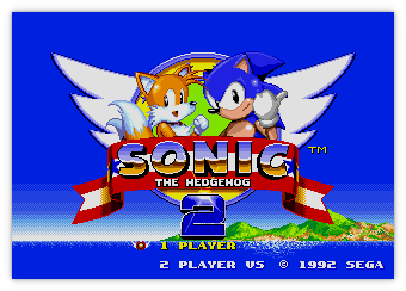
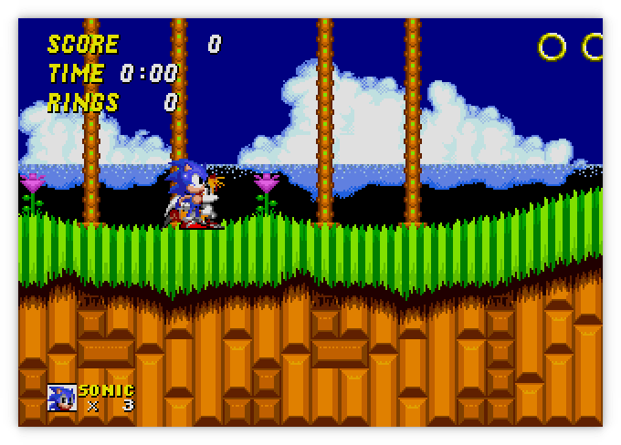
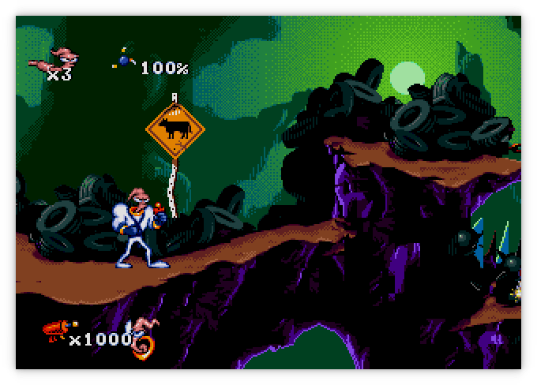
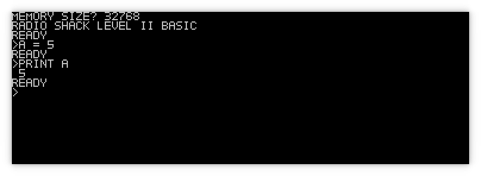

Moa
===

###### *Started September 26, 2021*

Moa is an emulator/simulator for computers using various 68000 and Z80 CPUs and
peripherals.  The original idea was to emulate the computer I had built as part
of the [Computie project](https://jabberwocky.ca/projects/computie/).

Currently it can simulate the Sega Genesis, Computie (68000), and the TRS-80
Model I (Z80).  Support for the Macintosh 512k is partially implemented but the
ROM still wont boot.

For more details on how it works, check out this post about how I started the project:
[Making a 68000 Emulator in Rust](https://jabberwocky.ca/posts/2021-11-making_an_emulator.html)

For more about the Sega Genesis support, check out this series I wrote about implementing it:
[Emulating the Sega Genesis](http://jabberwocky.ca/posts/2022-01-emulating_the_sega_genesis_part1.html)

I've also generated rustdocs of the workspace. All the various crates within moa
are listed in the crates section in the sidebar on the left. There's not a lot
of doc comments in the code yet but I plan to eventually write more:
[rustdocs for moa_core](http://jabberwocky.ca/moa/doc/moa_core/)
[rustdocs for ym2612](http://jabberwocky.ca/moa/doc/moa_peripherals_yamaha/ym2612/index.html)

This repository uses submodules, so make sure to clone with
```sh
git clone --recurse-submodules git@github.com:transistorfet/moa.git
```


Sega Genesis/MegaDrive
----------------------

From the project root, run the following:
```
cargo run -p moa_minifb --release --bin moa-genesis -- <ROM FILE>
```

The Genesis emulator is slowly coming along.  It can play a decent number of
game, but some games wont display anything, and a few games run but don't
respond to the controller input.  Games that require extra memory or nvram that
would normally be inside the cartridge usually crash.

It only supports NTSC mode at the moment, and only VDP mode 5 (not the backwards
compatible mode 4).  I've rewritten the frame drawing code to operate pixel by
pixel, so it will now draw all the layers, including the window, sort out the
priority of the pixels, and almost accurately implement the shadow and highlight
colour modes.  Audio is not implemented yet.

~~There are still some problems like the colour of Tails in the Sonic 2 title
screen being off.  I'm not sure why that happens, but it could be trying to
update the colours during the drawing of the frame, and since the code is
drawing the entire frame at once when the vertical blanking period is reached,
the on-the-fly changes don't have an affect.~~
I've since fixed the colour issue with Tails by fixing some 68000 instruction
behaviour with the help of
[Tom Harte's test suite](https://github.com/TomHarte/ProcessorTests).



The game play is mostly working but the time in the upper left corner doesn't
seem to progress




Earthworm Jim was working before I fixed the controller behaviour in Sonic 2,
which seems to have broken it in Earthworm Jim (and Mortal Kombat 1).



The following gif was only recorded at 15 frames a second instead of the full
60, so it appears jerky and some animations seem to freeze in the gif, even
though that doesn't happen during normal play


Computie
--------

For Computie, it can do everything the 68k-SMT board can do, including run the
monitor program and load the Computie OS kernel and boot it from the
CompactFlash card.  To run it:
```
cargo run -p moa_console --bin moa-computie
```
It will open two PTYs: one for the serial terminal, and one for the SLIP
connection.  Once open, it will try to launch both `pyserial-miniterm` as a
separate process and connect to the Computie PTY.  It will also launch
`slattach` with the associated setup commands to create the SLIP device on the
host, and set up host routing.  The exact commands in
`src/machines/computie.rs` might need to be adjusted to work on different
hosts.


TRS-80
------

For the TRS-80, it can run Level I or Level II Basic, but it doesn't yet
support a cassette tape drive or floppy drive.  I haven't tested it that
thoroughly either, so any help with it would be welcome.  I mostly made it to
test the Z80 cpu implementation in a simpler computer before I used in the
Genesis emulator.  The frontend uses the
[`minifb`](https://github.com/emoon/rust_minifb) rust crate to open a window
and render the characters to screen, as well as accept input from the keyboard.
```
cargo run -p moa_minifb --release --bin moa-trs80
```
By default it will start Level I Basic.  To use the other rom, add the option
`--rom binaries/trs80/level2.rom`



The characters are being drawn pixel by pixel (6x8) using characters I drew
using [this handy website](https://maxpromer.github.io/LCD-Character-Creator/).
They aren't a perfect match of the characters used by the TRS-80


General Options
---------------

By default, the minifb frontend will scale the window by 2.  This can be
changed with the `--scale [1,2,4]` option.

The `-t` or `--threaded` options will run the simulated hardware in a separate
thread from the frontend, which will run as fast as possible, faster than
real-time.   By default, the simulated hardware is run inline with the frontend's
update cycle, which is limited to 60Hz. The simulation will be run for 16.6ms of
simulated time for each frame the frontend draws.  But the simulated time is not
accurate and Sega Genesis games will run slower than they should.

The `-d` or `--debugger` option will make the emulator start the debugger
before running.  There is a simple built-in debugger for stepping through
the rom instructions being emulated.  The state of the CPU registers will
be displayed after each instruction, breakpoints can be set, memory contents
can be examined, and memory locations can be modified.  This has helped a lot
with tracking down errors in the emulator itself.

The `-x` or `--speed` option, when given a decimal number, will multiply that
number by the milliseconds per frame, increasing or decreasing the gameplay
clock relative to the frontend's update loop.  Setting it to 0.5 slows the game
down to half speed and setting it to 2 doubles the speed.

The `-a` or `--disable-audio` option will prevent the audio device from being
created, so no audio will be played (although it will still be simulated by any
devices that simulate it).

