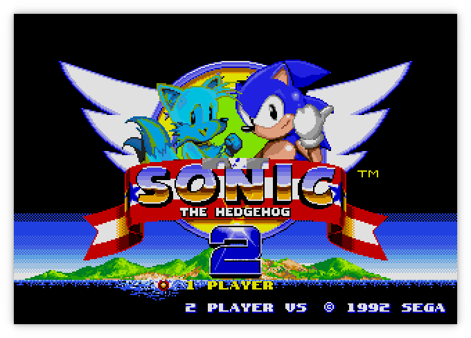

Moa
===

###### *Started September 26, 2021*

Moa is an emulator/simulator for computers using various 68000 and Z80 CPUs and
peripherals.  The original idea was to emulate the computer I had built as part
of the [Computie project](https://jabberwocky.ca/projects/computie/).

Currently it can simulate Computie (68000) and the TRS-80 Model I (Z80), and I'm
working on supporting the Macintosh 512k and Sega Genesis.

For more detail, check out this post about how I started the project:
[Making a 68000 Emulator in Rust](https://jabberwocky.ca/posts/2021-11-making_an_emulator.html)


Computie
--------

For Computie, it can do everything the 68k-SMT board can do, including run the
monitor program and load the Computie OS kernel and boot it from the
CompactFlash card.  To run it:
```
cargo run -p moa-console --bin moa-computie
```
It will open two PTYs: one for the serial terminal, and one for the SLIP
connection.  Once open, it will try to launch both `pyserial-miniterm` as a
separate process and connect to the Computie PTY.  It will also launch
`slattach` with the associated setup commands to create the SLIP device on the
host, and set up host routing.  The exact commands in
`src/machines/computie.rs` might need to be adjusted to work on different
hosts.

TRS-80
------

For the TRS-80, it can run Level I or Level II Basic, but it doesn't yet
support a cassette tape drive or floppy drive.  I haven't tested it that
thoroughly either, so any help with it would be welcome.  I mostly made it to
test the Z80 cpu implementation in a simpler computer before I used in the
Genesis emulator.  The frontend uses the
[`minifb`](https://github.com/emoon/rust_minifb) rust crate to open a window
and render the characters to screen, as well as accept input from the keyboard.
```
cargo run -p moa-minifb --release --bin moa-trs-80
```
By default it will start Level I Basic.  To use the other rom, add the option
`--rom binaries/trs80/level2.rom`


The characters are being drawn pixel by pixel (6x8) using characters I drew
using [this handy website](https://maxpromer.github.io/LCD-Character-Creator/).
They aren't a perfect match of the characters used by the TRS-80

Sega Genesis/MegaDrive
----------------------

It can be run with:
```
cargo run -p moa-minifb --release --bin moa-genesis -- <ROM FILE>
```

The Genesis emulator is a work in progress.  It can play a few games but some
games won't run because the bank switching for the Z80 coprocessor is not
working yet, and some games will hang waiting for the Z80 to respond.  For the
video processor, the window layer is not drawn and the layer priority is not
handled.  The horizontal scroll also doesn't work on a line-by-line basis so it
tends to be quite jerky as you move, with the sprites and cells misaligned
until you've moved one complete cell over (8x8 pixels).

On the Sonic 2 title screen, the colours for Tails are wonky, probably because
there's some trickery going on to get more than 16 colours per line, but the
emulator currently renders the whole frame at once instead of line by line, so
changes that should be made while the screen is updating don't show up



The game play is mostly working but the bottom of the clouds should be a
different colour, probably because highlight/shadow colours are not yet
supported.  The time in the upper left corner also doesn't seem to progress


I'm not yet sure why the clouds in the background are cut off suddenly.  They
change in a glitchy way when you move around


There are some graphics glitches in Earthworm Jim, but it's almost playable if it
wasn't for the 'jump' button, which only makes him jump a few pixels


General Options
---------------

By default, the minifb frontend will scale the window by 2.  This can be
changed with the `--scale [1,2,4]` option.

The `-t` or `--threaded` options will run the simulated hardware in a separate
thread from the frontend, which will run as fast as possible, faster than
real-time.   By default, the simulated hardware is run inline with the frontend's
update cycle, which is limited to 60Hz. The simulation will be run for 16.6ms of
simulated time for each frame the frontend draws.  But the simulated time is not
accurate and Sega Genesis games will run slower than they should.

The `-d` or `--debugger` option will make the emulator start the debugger
before running.  There is a simple built-in debugger for stepping through
the rom instructions being emulated.  The state of the CPU registers will
be displayed after each instruction, breakpoints can be set, memory contents
can be examined, and memory locations can be modified.  This has helped a lot
with tracking down errors in the emulator itself.

