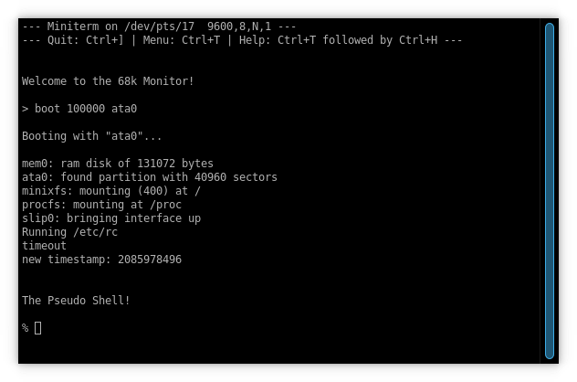

Making a 68000 Emulator in Rust
===============================

*Also available on [dev.to](https://dev.to/transistorfet/making-a-68000-emulator-in-rust-1kfk)*

###### *Written November 2021 by transistor_fet*


A few months ago, I was looking for a project to do while recovering from a bout of illness.  I
needed something that was straight-forward enough to work on without getting stuck on tough
decisions or the need to learn a lot before diving in, which was the case with all the other
projects on my plate at the time.  My girlfriend suggested writing an
[emulator](https://jabberwocky.ca/projects/moa/), and my first thought was to try emulating the
computer I made last year, [Computie](https://jabberwocky.ca/projects/Computie/), since I already
had a fair amount of code for it that I knew well, and the 68000 architecture and assembly language
was still fresh in my mind.  Naturally I chose to write it in Rust.

I've worked on different projects that have some vague similarities to emulators, such as
programming language interpreters and artificial life simulations but I haven't actually tried to
make an emulator before.  I'm not aiming to make a fast emulator, and since this is meant to be fun,
I'm not *as* concerned about accuracy (specifically instruction execution time accuracy).  I would,
however, like something that's flexible enough to experiment with different hardware designs.
Perhaps I could use this with some of my future hardware designs to test out hardware configurations
and to develop and test the software that runs on them.  It would also be nice to emulate some
vintage computers that use the 68000, which each have their own I/O devices that would need
simulating.  With that in mind, we should work towards making independent components for each
device, which interact in regular ways and can be combined in different configurations without the
need to modify the components themselves (ie. no tight coupling of components)

I chose Rust because it's currently my favorite systems language.  I've used C and C++ quite a bit
as well, but Rust's advanced type system is much more pleasant to work with, and the compile-time
checks means I can focus less on simple bugs and more on the problem at hand, getting more done in
the same amount of time.  I'm assuming here some familiarity with Rust, as well as the basic
principles of how a computer works, but not necessarily that much about the 68000 or emulators.  We
will start with some code to simulate the computer memory, creating an abstract way of accessing
data.  We'll then implement the NOP (no operation) instruction, the simplest possible instruction,
for the 68000, and expand the implementation from there.  Once we've created a way of handling the
passage of time for the CPUs and I/O devices, we'll implement a simple serial port controller which
will act as our primary I/O device.  From there we'll make all of our simulated devices, represented
as `struct` objects in Rust, look the same so that we can treat them the same, regardless of what
they represent internally.  We'll then be able to package them up into a single working system and
set them in motion to run the Computie software from binary images.

* [The Computer](#the-computer)
* [The 68000](#the-68000)
* [The 68681 Serial Port Controller](#the-68681-serial-port-controller)
* [The Memory](#the-memory)
* [Simulating The CPU](#simulating-the-cpu)
* [Adding Instructions](#adding-instructions)
* [Abstracting Time](#abstracting-time)
* [Some I/O](#some-i-o)
* [Box It Up](#box-it-up)
* [An Addressable of Addressables (The Data Bus)](#an-addressable-of-addressables--the-data-bus-)
* [A Happy Little System](#a-happy-little-system)
* [Tying It All Together](#tying-it-all-together)
* [Now What](#now-what)


The Computer
------------

Computie is a single board computer with a Motorola 68010 CPU connected to 1MB of RAM, some flash,
and an MC68681 dual serial port controller, which handles most of the I/O.  (The
[68010](https://en.wikipedia.org/wiki/Motorola_68010) is almost identical to the 68000 but with some
minor fixes which won't affect us here.  I'll mostly be referring to the common aspects of both
processors).  One of the serial connections is used as a TTY to interact with either the unix-like
Computie OS, or the monitor software that's normally stored in the flash chip.  It also supports a
CompactFlash card and SLIP connection over the other serial port for internet access, but we won't
cover those here.  In order to get a working emulator, we'll focus on just the CPU, memory, and
MC68681 controller.


The 68000
---------

The 68000 is 32-bit processor with a 16-bit data bus and 16-bit arithmetic logic unit.  It was used
on many early computers including the early Macintosh series, the early Sun Microsystems
workstations, the Amiga, the Atari ST, and the Sega Genesis/Mega Drive, just to name a few.  It was
almost chosen for the IBM PC as well, but IBM wanted to use an inexpensive 8-bit data bus in the PC,
and the 68008 (with an 8-bit data bus) wasn't available at the time.  The 8088, with it's 8-bit bus,
was available however, and we have been stuck with that decision ever since.

The 68000 has 8 32-bit general purpose data registers, and 7 32-bit general purpose address
registers plus two stack registers which can be accessed as the 8th address register depending on
whether the CPU is in Supervisor mode or User mode.  Internally the address registers use a separate
bus and adder unit from the main arithmetic logic unit, which only operates on the data registers.
This affects which instructions can be used with which registers, and operations on address
registers don't always affect the condition flags (which has caused me many troubles both when
writing the Computie software, and with the implementation of instructions here).

A 16-bit status register is used for condition codes and for privileged flags like the Supervisor
mode enable flag and the interrupt priority level.  Only the lower 8 bits can be modified from User
mode.  The conditions flags are set by many of the instructions based on their results, and can be
checked by the conditional jump instructions to branch based on the results of comparisons.

The program counter register keeps track of the next instruction to be executed.  Instructions are
always a multiple of 2-byte words, and the CPU uses [big
endian](https://en.wikipedia.org/wiki/Endianness) byte order, so the most significant byte will
always be in the lower byte address in memory.  As an example, the NOP instruction uses the opcode
0x4E71, where 0x4E would be the first byte in memory followed by 0x71.  A longer instruction like
ADDI can have instruction words after the opcode (in this case the immediate data to add).  For
example, `addil #0x12345678, %d0` which adds the hex number 0x12345678 to data register 0 would
be encoded as the sequence of words [0x0680, 0x1234, 0x5678].  The opcode word, 0x0680, has encoded
in it that it's an ADDI instruction, that the size of the operation is a long word (32-bit), and
that it should use data register 0 as both the number to add to, and the destination where the
result will be stored.  (Note: 68000 assembly language instructions move data from the left hand
operand to the right hand operand, unlike Intel x86 assembly language which uses the reverse).

A vector table is expected at address 0 which contains an array of up to 256 32-bit addresses.  The
first address contains the value to be loaded into the Supervisor stack register upon reset, and the
remaining addresses are the value loaded into the program counter when a given exception occurs.
This table cannot be relocated on the 68000, but it can be changed after reset on the 68010.
Computie uses the 68010 for this exact feature, so that the OS can put the vector table in RAM, but
the monitor software doesn't use interrupts.  We won't cover interrupts here so this feature isn't
needed for now and we can focus only on emulating the 68000.  As for the vector table, we just need
to simulate how the processor starts up on power on or after a reset, in which case the vector table
is always at address 0, and the first two long words are the stack pointer and initial program
counter respectively.


The 68681 Serial Port Controller
--------------------------------

The MC68681 is a peripheral controller designed specifically for use with the 68000 series.  It has
two serial channels, A and B, as well as an onboard 16-bit timer/counter, 8 general purpose output
pins, and 6 general purpose input pins.  Internally it has 16 registers which can be read or written
to from the CPU.  The behaviour of the 16 registers is sometimes different between reading and
writing, such as the status registers (SRA & SRB) which indicate the current status of the serial
ports when read, and the clock select registers (CSRA & CSRB) which configure the serial port clocks
when writing to the same address as the status registers.  It can also generate an interrupt for
one of 8 different internal conditions, such as data ready to read on a given channel, or the timer
reaching zero.  It uses it's own clock signal to generate the serial clocks and to count down with,
so it will need to run some code along side the CPU to simulate its internal state.


The Memory
----------

Now that we have a bit of background on the devices we'll be emulating, lets start making the
emulator.  The first thing we'll need in order to emulate our computer is a way of accessing and
addressing memory where instruction data can be read from.  We need to eventually have a common way
of reading and writing to either simulated ram, or simulated I/O devices.  Since we want to keep
things generic and interchangeable, using Rust enums for the different devices in the system would
be too tightly-coupled.  Traits it is, so we'll start with an `Addressable` trait.

```rust
type Address = u64;     // I (wishfully) chose u64 here in case
                        // I ever emulate a 64-bit system

pub trait Addressable {
    fn len(&self) -> usize;
    fn read(&mut self, addr: Address, data: &mut [u8]) -> Result<(), Error>;
    fn write(&mut self, addr: Address, data: &[u8]) -> Result<(), Error>;
    ...
}
```

I went through a few different iterations of this, especially for the `.read()` method.  At first I
returned an iterator over the data starting at the address given, which works well for simulated
memory, but reading from an I/O device could return data that is unique to when it was read.  For
example, when reading the next byte of data from a serial port, the data will be removed from the
device's internal FIFO and returned, and since at that point it won't be stored anywhere, we can't
have a reference to it.  We need the data (of variable length) to be owned by the caller when the
method returns, and passing in a reference to a mutable array to hold that data is a simple way to
do that.

We can also add some default methods to the trait which will make it easier to access multi-byte
values.  The example here only shows methods to read and write 16 bit numbers in big endian byte
order but there are also similar methods for 32-bit numbers and for little endian numbers.

```rust
pub trait Addressable {
    ...
    fn read_beu16(&mut self, addr: Address) -> Result<u16, Error> {
        let mut data = [0; 2];
        self.read(addr, &mut data)?;
        Ok(read_beu16(&data))
    }

    fn write_beu16(&mut self, addr: Address, value: u16) -> Result<(), Error> {
        let mut data = [0; 2];
        write_beu16(&mut data, value);
        self.write(addr, &data)
    }
    ...
}

#[inline(always)]
pub fn read_beu16(data: &[u8]) -> u16 {
    (data[0] as u16) << 8 |
    (data[1] as u16)
}

#[inline(always)]
pub fn write_beu16(data: &mut [u8], value: u16) -> &mut [u8] {
    data[0] = (value >> 8) as u8;
    data[1] = value as u8;
    data
}
```

Now for some simulated ram that implements our trait.  (I'm leaving out the `.new()` methods for
most of the code snippets because they are pretty straight-forward, but you can assume they exist,
and take their field values as arguments, or set their fields to 0).

```rust
pub struct MemoryBlock {
    pub content: Vec<u8>,
}

impl Addressable for MemoryBlock {
    fn len(&self) -> usize {
        self.contents.len()
    }

    fn read(&mut self, addr: Address, data: &mut [u8]) -> Result<(), Error> {
        for i in 0..data.len() {
            data[i] = self.contents[(addr as usize) + i];
        }
        Ok(())
    }

    fn write(&mut self, addr: Address, data: &[u8]) -> Result<(), Error> {
        for i in 0..data.len() {
            self.contents[(addr as usize) + i] = data[i];
        }
        Ok(())
    }
}
```


Simulating The CPU
------------------

With just the Addressable trait, we can start simulating the CPU.  Each cycle of the CPU involves
reading in instruction data, decoding it, executing the instruction, modifying the stored state of
the CPU, and finally checking for interrupts or breakpoints before looping again.  We don't need all
of this to start though, so first lets make some CPU state so that we at least have a PC (program
counter) to keep track of the instruction data we've read.

```rust
#[derive(Copy, Clone, Debug, PartialEq)]
pub enum M68kStatus {
    Init,
    Running,
    Stopped,
}

#[derive(Clone, Debug, PartialEq)]
pub struct M68kState {
    pub status: M68kStatus,

    pub pc: u32,            // Program Counter
    pub sr: u16,            // Status Register
    pub d_reg: [u32; 8],    // Data Registers
    pub a_reg: [u32; 7],    // Address Registers
    pub ssp: u32,           // Supervisor Stack Pointer
    pub usp: u32,           // User Stack Pointer
}

pub struct M68k {
    pub state: M68kState,
    ...
}
```
(I've separated the state into its own struct, separate from the `M68k` struct, in part to make it
cleaner, but mostly to make it easier to test.  We can get a complete known state using just
M68kState::new(), and we can clone, modify, and compare states because we've derived `PartialEq`, so
after running a test on a given instruction, we only need one `assert_eq!(cpu.state,
expected_state)` to check if the resulting state is what we expected).

Next we need to initialize the CPU.  When the 68000 is reset, it first reads in the stack pointer
and initial value of the PC register from the beginning of memory where the vector table is located.

```rust
impl M68k {
    ...
    pub fn init(&mut self, memory: &mut dyn Addressable) -> Result<(), Error> {
        self.state.ssp = memory.read_beu32(0)?;
        self.state.pc = memory.read_beu32(4)?;
        self.state.status = M68kStatus::Running;
        Ok(())
    }
    ...
}
```

Since the decoding of instructions can be a bit convoluted, and since speed is not our utmost goal, it's
cleaner to decode the instructions fully into some kind of internal representation, and then execute
them based on that representation.  For now, lets just add a NOP instruction.

```rust
#[derive(Clone, Debug)]
pub enum Instruction {
    NOP,
}

impl M68k {
    pub fn read_instruction_word(&mut self, memory: &mut dyn Addressable) -> Result<u16, Error> {
        let ins = memory.read_beu16(self.state.pc as Address)?;
        self.state.pc += 2;
        Ok(ins)
    }

    pub fn decode(&mut self, memory: &mut dyn Addressable) -> Result<Instruction, Error> {
        let ins = self.read_instruction_word(memory)?;

        match ins {
            0x4E71 => Ok(Instruction::NOP),
            _ => panic!("instruction not yet supported: {:#04X}", ins),
        }
    }
}
```

We can then make a function to execute the decoded instruction

```rust
impl M68k {
    pub fn execute(&mut self, memory: &mut dyn Addressable, instruction: Instruction) -> Result<(), Error> {
        match instruction {
            Instruction::NOP => {
                // Do Nothing
                Ok(())
            },
            _ => panic!("Instruction not implemented: {:?}", instruction),
        }
    }
}
```

And finally a function to wrap these stages together into a single step.  For debugging purposes
we'll print out what instruction we're about to execute after decoding but before executing.

```rust
impl M68k {
    pub fn step(&mut self, memory: &mut dyn Addressable) -> Result<(), Error> {
        match self.state.status {
            M68kStatus::Init => self.init(memory),
            M68kStatus::Stopped => Err(Error::new("cpu has stopped")),
            M68kStatus::Running => {
                let addr = self.state.pc;
                let instruction = self.decode(memory)?;
                println!("{:08x}: {:?}", addr, instruction);
                self.execute(memory, instruction)?;
                Ok(())
            },
        }
    }
}
```

At this point we have enough pieces to loop over a series of NOP instructions.  Our main function
looks like the following
```rust
const ROM: &[u16] = &[
    0x0010, 0x0000,     // Initial stack address is at 0x00100000
    0x0000, 0x0008,     // Initial PC address is at 0x8, which is the word
                        //  that follows this

    0x4e71,             // 4 NOP instructions
    0x4e71,             
    0x4e71,
    0x4e71,             

    0x4e72, 0x2700      // The STOP #0x2700 instruction, which would normally
                        //  stop the CPU but it's unsupported, so it will
                        //  cause a panic!()
];

let mut cpu = M68k::new();
let mut memory = MemoryBlock::from_u16(ROM);
loop {
    cpu.step(&mut memory).unwrap();
}
```

Our output should look something like this:
```
00000008: NOP
0000000a: NOP
0000000c: NOP
0000000e: NOP
thread 'main' panicked at 'instruction not yet supported: 0x4E72', src/main.rs:184:18
```


Adding Instructions
-------------------

Since the 68000 has a reasonably orthogonal instruction set, we can break down the opcode word into
sub-components, and build up instructions by separately interpreting those sub-components, rather
than having a match arm for each of the 65536 combinations.  There is a really helpful [chart by
GoldenCrystal](http://goldencrystal.free.fr/M68kOpcodes-v2.3.pdf) which shows the full breakdown of
opcodes for the 68000.  We can look at the first 4 bits of the instruction word to separate it into
16 broad categories of instruction, and then further break it down from there.  The full code can be
seen [here](https://github.com/transistorfet/moa/blob/c3951999771bbb56f45e1a8c5cd0b61758aed778/src/cpus/m68k/decode.rs)

We can extend our `Instruction` type to contain more instructions, including the addressing modes
that the 68000 supports.  A `MOVE` instruction for example can move data to or from a data or
address register, or to memory indirectly using an address in an address register (optionally
pre-decrementing or post-incrementing the address), or indirectly using an offset added to an
address register, as well as a few others.  Since these different addressing modes are available for
most instructions, we can wrap them up into a `Target` type, and use that as the arguments of
instructions in the `Instruction` type.  For example, the instruction `addil #0x12345678, %d0` would
be represented as `Instruction::ADD(Target::Immediate(0x12345678), Target::DirectDReg(0),
Size::Long)`.  We will maintain the same operand order as the 68k assembly language so data will
move from the left hand operand (`0x12345678`) to the right hand operand (`%d0`).

```rust
pub type Register = u8;

#[derive(Copy, Clone, Debug, PartialEq)]
pub enum Size {
    Byte,
    Word,
    Long,
}

#[derive(Copy, Clone, Debug, PartialEq)]
pub enum Condition {
    NotEqual,
    Equal,
    ...
}

#[derive(Copy, Clone, Debug, PartialEq)]
pub enum Target {
    Immediate(u32),                     // A u32 literal
    DirectDReg(Register),               // Contents of a data register
    DirectAReg(Register),               // Contents of an address register
    IndirectAReg(Register),             // Contents of a memory location given by an address register
    IndirectARegInc(Register),          // Same as IndirectAReg but increment the address register
                                        // by the size of the operation *after* reading memory
    IndirectARegDec(Register),          // Same as IndirectAReg but decrement the address register
                                        // by the size of the operation *before* reading memory
    IndirectARegOffset(Register, i32),  // Contents of memory given by an address register plus the
                                        // signed offset (address register will *not* be modified)
    IndirectPCOffset(i32),              // Same as IndirectARegOffset but using the PC register
    IndirectMemory(u32),                // Contents of memory location given by literal u32 value
}

#[derive(Clone, Debug, PartialEq)]
pub enum Instruction {
    ADD(Target, Target, Size),          // Addition
    ADDA(Target, Register, Size),       // Adding to an address register
                                        //  doesn't affect flags

    Bcc(Condition, i32),                // Branch Conditionally
    BRA(i32),                           // Branch to PC + offset
    BSR(i32),                           // Branch to Subroutine
                                        //  (Push PC; PC = PC + offset)

    JMP(Target),                        // Set the PC to the given value
    JSR(Target),                        // Push PC to the stack and then
                                        //  set PC to the given value

    LEA(Target, Register),              // Load effective address into
                                        //  address register

    MOVE(Target, Target, Size),
    MOVEA(Target, Register, Size),
    NOP,

    RTS,                                // Return from subroutine (Pop PC)
    STOP(u16),                          // Load word into SR register and
                                        //  stop until an interrupt

    SUB(Target, Target, Size),          // Subtraction
    SUBA(Target, Register, Size),
    ...
}
```
This is just an example of the instruction type definitions.  The full code can be found
[here](https://github.com/transistorfet/moa/blob/c3951999771bbb56f45e1a8c5cd0b61758aed778/src/cpus/m68k/instructions.rs).  Note: it's
possible to express more combinations with these instruction types than there are legal instruction
combinations.  Some combinations are illegal on the 68000 but allowed on the 68020 and up, which the
emulator supports using an enum to represent the different 68000 model numbers.  Most of the error
checking and version difference checking is done during the decode phase (and an illegal instruction
exception raised if necessary).  Some instructions have special behaviours, so they've been given
their own variant in the enum, like ADDA to add a value to an address register which doesn't affect
the condition codes the way the ADD instruction does, or CMPA to compare an address register which
sign extends byte or word operands to long words before comparing them.


Abstracting Time
----------------

In the case of a real CPU, the clock signal is what drives the CPU forward, but it's not the only
device in the system that is driven by a clock.  I/O devices, such as the MC68681 serial port
controller also take an input clock which affects their state over time.  In the case of the serial
port controller, it has a timer which needs to count down periodically.  We're going to need some
way of running code for different devices based on the clock, so lets use another trait for this.

```rust
pub type Clock = u64;
pub type ClockElapsed = u64;

trait Steppable {
    fn step(&mut self, memory: &mut dyn Addressable, clock: Clock) -> Result<ClockElapsed, Error>;
}
```

Now we can call the `step()` method each cycle and pass it the current clock value.  It will
return the number of clock ticks that should elapse before the next call to that device's `step()`
method.

In the case of Computie, the CPU runs at 10 MHz, but the serial port controller runs on a separate
clock at 3.6864 MHz.  In order to handle these different clock speeds, we can arbitrarily decide
that our `Clock` value will be the number of nanoseconds from the start of the simulation, and
`ClockElapsed` will be a difference in nanoseconds from the start of the start of the step.  We use
a `u64` here so that we can keep track of simulation time in nanoseconds for approximately 584 which
*should* be enough.  Keeping track of the time will allow us to later limit how much time passes
(either speeding up or slowing down the execution relative to real-time).  With this, we can get a
somewhat accurate count when simulating the timer in the serial controller chip.  That said, we won't
worry about simulating CPU execution times, which varies quite a bit based on each instruction and
it's operands, so can add a lot of complexity.


Some I/O
--------

It's time to implement the MC68681 serial port controller.  Since it's both an Addressable device
and a Steppable device, we'll need to implement both traits.  The registers we'll need to support
first are the serial port channel A registers.  `REG_TBA_WR` is the transmit write buffer, which
will output the character written to it over serial channel A.  We can just print the character
written to this register to the screen for now.  We also need to implement the `REG_SRA_RD`
register, which is a status register.  Bits 3 and 2 of the status register indicate if the transmit
buffer for channel A is ready and empty.  The software for Computie checks the status register
before writing data because the real MC68681 can't transmit fast enough to avoid a buffer overrun,
so as long as we return a value with those bits set, the software will write characters to the
`REG_TBA_WR` register.  This example also shows the `REG_RBA_RD` register for reading serial data
in, but setting the `port_a_input` field is not shown for simplicity.  The full code has be viewed
[here](https://github.com/transistorfet/moa/blob/c3951999771bbb56f45e1a8c5cd0b61758aed778/src/peripherals/mc68681.rs)

```rust
// Register Addresses (relative to mapped address)
const REG_SRA_RD: Address = 0x03;       // Ch A Status Register
const REG_TBA_WR: Address = 0x07;       // Ch A Byte to Transmit
const REG_RBA_RD: Address = 0x07;       // Ch A Received Byte
const REG_ISR_RD: Address = 0x0B;       // Interrupt Status Register

// Status Register Bits (SRA/SRB)
const SR_TX_EMPTY: u8  = 0x08;
const SR_TX_READY: u8  = 0x04;
const SR_RX_FULL: u8   = 0x02;
const SR_RX_READY: u8  = 0x01;

// Interrupt Status/Mask Bits (ISR/IVR)
const ISR_TIMER_CHANGE: u8 = 0x08;

struct MC68681 {
    pub port_a_status: u8,
    pub port_a_input: u8,

    pub is_timing: bool,
    pub timer: u16,
    pub int_status: u8,
}

impl Addressable for MC68681 {
    fn len(&self) -> usize {
        0x10
    }

    fn read(&mut self, addr: Address, data: &mut [u8]) -> Result<(), Error> {
        match addr {
            REG_SRA_RD => {
                data[0] = SR_TX_READY | SR_TX_EMPTY;
            },
            REG_RBA_RD => {
                data[0] = self.port_a_input;
                self.port_a_status &= !SR_RX_READY;
            },
            REG_ISR_RD => {
                data[0] = self.int_status;
            },
            _ => { },
        }
        debug!("{}: read from {:0x} of {:0x}", DEV_NAME, addr, data[0]);
        Ok(())
    }

    fn write(&mut self, addr: Address, data: &[u8]) -> Result<(), Error> {
        debug!("{}: writing {:0x} to {:0x}", DEV_NAME, data[0], addr);
        match addr {
            REG_TBA_WR => {
                // Print the character
                println!("{}", data[0] as char);
            },
            _ => { },
        }
        Ok(())
    }
}

impl Steppable for MC68681 {
    fn step(&mut self, memory: &mut dyn Addressable, clock: Clock) -> Result<ClockElapsed, Error> {
        if self.is_timing {
            // Count down, wrapping around from 0 to 0xFFFF
            self.timer = self.timer.wrapping_sub(1);

            if self.timer == 0 {
                // Set the interrupt flag
                self.int_status |= ISR_TIMER_CHANGE;
            }
        }

        // Delay for the number of nanoseconds of our 3.6864 MHz clock
        Ok(1_000_000_000 / 3_686_400)
    }
}
```

This implementation is enough to print the `Welcome to the 68k Monitor!` message that the monitor
software prints at boot, but we can't accept input yet.  Since Computie is meant to be connected via
TTY, we could open a new pseudoterminal on the host computer (Linux in this case), and then connect to
that pseudoterminal using `miniterm` like we would with the real Computie.  This will also free the
console window for debugging and log messages.

I originally implemented this using non-blocking input to check for a new character received on the
machine-end of the pseudoterm, and then storing it in a single byte in the MC68681 object, but I
later changed this to use a separate thread for polling, and `mpsc` channels to communicate with the
simulation thread.  It's a bit too much code to include here but you can see the full tty
implementation [here](https://github.com/transistorfet/moa/blob/c3951999771bbb56f45e1a8c5cd0b61758aed778/src/host/traits.rs)


Box It Up
---------

We have 3 different devices objects at this point: the CPU (`M68k`), the memory (`MemoryBlock`), and
the serial port controller (`MC68681`).  The CPU implements the `Steppable` trait, the memory
implements the `Addressable` trait, and the controller implements both.  That last one is a problem
because we can't have two mutable references to both the `Addressable` and `Steppable` trait objects
of the controller at the same time, and rust doesn't yet support trait objects implementing multiple
traits under these conditions.  Generics won't work either because we need to store the
`Addressable`s in some kind of list, and items in a list must have the same type, so we need some
other way of getting a reference to one of the trait objects only when we need to use it.  If we
weren't so adamant about making this flexible and configurable, we could possibly keep this simpler,
but alas, we are that adamant.  So lets introduce another trait, and some reference counted boxes!

```rust
pub trait Transmutable {
    fn as_steppable(&mut self) -> Option<&mut dyn Steppable> {
        None
    }

    fn as_addressable(&mut self) -> Option<&mut dyn Addressable> {
        None
    }
}
```

The `Transmutable` trait can be implemented for each device object, and it has a method for each of
our traits, which returns the trait object reference we need.  The default implementations return
`None` to indicate that the trait is not implemented for that device object.  Device objects that
*do* implement a given trait can redefine the `Transmutable` function to return `Some(self)`
instead.  That means that any `Transmutable` trait object can be turned into either an `Addressable`
or a `Steppable`, if supported by the underlying device object, and we have a way of checking that
support at runtime.

We top it all off with `TransmutableBox` which will allow us to have multiple references to any
`Transmutable` objects, so we can pass them around to build our machine configuration.
`wrap_transmutable` is a helper function to box up the device object during startup.  The device
objects will be set up once at start up and then not changed until the program terminates, so we're
not too concerned about reference cycles.

```rust
pub type TransmutableBox = Rc<RefCell<Box<dyn Transmutable>>>;

pub fn wrap_transmutable<T: Transmutable + 'static>(value: T) -> TransmutableBox {
    Rc::new(RefCell::new(Box::new(value)))
}
```

Using this method does introduce some performance penalties, but they are marginal relative to the
decode and execution times of each instruction and we can still achieve pretty decent instruction
cycle speeds despite the overhead.  If speed was a concern, we might try to avoid the `Transmutable`
trait by also eliminating our `Steppable` trait and using a static machine configuration where the
device object types are known at compile time and the top level function for each machine
configuration would drive the simulation forward.  This latter style architecture is used by many
other emulators, such as the [ClockSignal (CLK)](https://github.com/TomHarte/CLK) emulator (which
has a very well organized and easy to read codebase if you're looking for another emulator project
to learn from).  The downside is that each machine requires more machine-specific top level code to
tie the pieces together.

If anyone knows of a better way to organize this so that we can get the best of both worlds, speed
and the ability to abstract away all the devices without tight coupling, I'd love to heard about it.
I'm always looking for new ways to design things in Rust.


An Addressable of Addressables (The Data Bus)
---------------------------------------------

With this new trait, all of our devices look the same regardless of the combinations of traits they
implement.  We can store them all in the same list, as well as pass them to other objects to be
turned into their respective trait references when needed.  We can now implement a `Bus` to hold our
`Addressable`s so that we can access them all through the same address space

```rust
pub struct Block {
    pub base: Address,
    pub length: usize,
    pub dev: TransmutableBox,
}

pub struct Bus {
    pub blocks: Vec<Block>,
}

impl Bus {
    /// Insert the devices in the correct address order
    pub fn insert(&mut self, base: Address, length: usize, dev: TransmutableBox) {
        let block = Block { base, length, dev };
        let i = self.blocks.iter().position(|cur| cur.base > block.base).unwrap_or(self.blocks.len());
        self.blocks.insert(i, block);
    }

    /// Find the device that's mapped to the given address range, and return
    /// the device, as well as the given address minus the device's base address
    pub fn get_device_at(&self, addr: Address, count: usize) -> Result<(TransmutableBox, Address), Error> {
        for block in &self.blocks {
            if addr >= block.base && addr < (block.base + block.length as Address) {
                let relative_addr = addr - block.base;
                if relative_addr as usize + count <= block.length {
                    return Ok((block.dev.clone(), relative_addr));
                } else {
                    return Err(Error::new(&format!("Error reading address {:#010x}", addr)));
                }
            }
        }
        return Err(Error::new(&format!("No segment found at {:#010x}", addr)));
    }
}

impl Addressable for Bus {
    fn len(&self) -> usize {
        let block = &self.blocks[self.blocks.len() - 1];
        (block.base as usize) + block.length
    }

    fn read(&mut self, addr: Address, data: &mut [u8]) -> Result<(), Error> {
        let (dev, relative_addr) = self.get_device_at(addr, data.len())?;
        let result = dev.borrow_mut().as_addressable().unwrap().read(relative_addr, data);
        result
    }

    fn write(&mut self, addr: Address, data: &[u8]) -> Result<(), Error> {
        let (dev, relative_addr) = self.get_device_at(addr, data.len())?;
        let result = dev.borrow_mut().as_addressable().unwrap().write(relative_addr, data);
        result
    }
}
```

Our `Bus` can act like an `Addressable`, so anything that's mapped to an address on the bus can be
accessed through the same `&mut Addressable` allowing us to pass it to the CPU's `.step()` method.


A Happy Little System
---------------------

The last piece we need is a way to call all of our `.step()` methods, but only the top level loop
needs to be able to call them, so we don't need to package them up the same as `Addressable`.  We
do, however, need to keep track of the passage of time.  We can make a `System` to hold our pieces,
which can also hold our event tracking code, and our `Bus`.

```rust
pub struct NextStep {
    pub next_clock: Clock,
    pub device: TransmutableBox,
}

struct System {
    pub clock: Clock,
    pub bus: Bus,
    pub event_queue: Vec<NextStep>,
}

impl System {
    /// Insert into the queue such that the last device is the next step to execute
    fn queue_device(&mut self, device_step: NextStep) {
        for i in (0..self.event_queue.len()).rev() {
            if self.event_queue[i].next_clock > device_step.next_clock {
                self.event_queue.insert(i + 1, device_step);
                return;
            }
        }
        self.event_queue.insert(0, device_step);
    }

    /// Add a device to the system, and if it's `Steppable` then queue it
    pub fn add_device(&mut self, device: TransmutableBox) -> Result<(), Error> {
        if device.borrow_mut().as_steppable().is_some() {
            self.queue_device(NextStep::new(device));
        }
        Ok(())
    }

    /// Add a device to the system while also mapping it to the given address on the bus
    pub fn add_addressable_device(&mut self, addr: Address, device: TransmutableBox) -> Result<(), Error> {
        let length = device.borrow_mut().as_addressable().unwrap().len();
        self.bus.insert(addr, length, device.clone());
        self.add_device(device)
    }

    /// Execute one step function from the queue
    pub fn step(&mut self) -> Result<(), Error> {
        // Remove the last item in the queue which is the next step to execute
        let mut next_device = self.event_queue.pop().unwrap();

        self.clock = next_device.next_clock;
        let memory = self.bus.as_addressable().unwrap();

        // Execute the step function
        let diff = next_device.device.borrow_mut().as_steppable().unwrap().step(memory, self.clock)?;
        // Adjust the device's next scheduled step
        next_device.next_clock = self.clock + diff;

        // Re-insert into the queue in order of next event
        self.queue_device(next_device);
        Ok(())
    }

    /// Run step functions until the system clock has changed by the given time in nanoseconds
    pub fn run_for(&mut self, elapsed: ClockElapsed) -> Result<(), Error> {
        let target = self.clock + elapsed;

        while self.clock < target {
            self.step()?;
        }
        Ok(())
    }
}
```

In later iterations, I pass the whole immutable reference to `System` into the step functions, and
put `Bus` inside a `RefCell` which can then be accessed if needed by the `.step()` function for the
device object.  I've also added an interrupt controller to `System` which can be used for hardware
interrupts from devices (`MC68681` in the case of Computie).


Tying It All Together
---------------------

Finally we can tie all our pieces together and set them in motion.

```rust
fn main() -> Result<(), Error> {
    let mut system = System::new();

    // Create our Flash memory, pre-loaded with our Computie monitor firmware
    let rom = MemoryBlock::load("binaries/computie/monitor.bin")?;
    system.add_addressable_device(0x00000000, wrap_transmutable(rom))?;

    // Create a RAM segment at the 1MB address
    let mut ram = MemoryBlock::new(vec![0; 0x00100000]);
    system.add_addressable_device(0x00100000, wrap_transmutable(ram))?;

    let mut serial = MC68681::new();
    // Open a new PTY and launch a terminal emulator that in turn
    // launches miniterm and connects to the other end of the PTY
    launch_terminal_emulator(serial.port_a.connect(Box::new(SimplePty::open()?))?);
    system.add_addressable_device(0x00700000, wrap_transmutable(serial))?;

    let mut cpu = M68k::new(M68kType::MC68010);
    system.add_device(wrap_transmutable(cpu))?;

    // Run forever
    system.run_for(u64::MAX)?;
    Ok(())
}

pub fn launch_terminal_emulator(name: String) {
    use std::thread;
    use std::time::Duration;
    use std::process::Command;

    Command::new("x-terminal-emulator").arg("-e").arg(&format!("pyserial-miniterm {}", name)).spawn().unwrap();
    thread::sleep(Duration::from_secs(1));
}
```

We can now boot our monitor firmware and once interrupts are added, we can even boot the OS!




Now What
--------

After only a couple weeks I was able to get all of the Computie software running, including the OS,
albeit with a buggy and incomplete 68000 implementation.  That didn't seem too hard.  What else can
I get running inside this emulator.  How about I try emulating the Sega Genesis!  How hard can it
be?  Well... after a few months it's damn near broken me, but I'm determined to complete it
eventually.  I've also taken detours into emulating the original Macintosh (simpler than the Genesis
so easier to debug the 68k implementation with) and the TRS-80 (in order to test the Z80
implementation I made to eventually use in the Genesis).  I'm hoping to write more about those other
efforts, once I get them somewhat working.  Until then, happy emulating!

