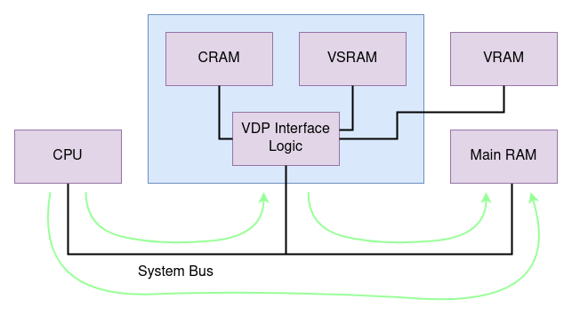

Emulating the Sega Genesis - Part I
===================================

*Also available on [dev.to](https://dev.to/transistorfet/emulating-the-sega-genesis-part-i-1ao5)*

###### *Written December 2021/January 2022 by transistor_fet*


A few months ago, I wrote a 68000 emulator in Rust named
[Moa](https://jabberwocky.ca/projects/moa/).  My original goal was to emulate a simple
[computer](https://jabberwocky.ca/projects/computie/) I had previously built.  After only a few
weeks, I had that software up and running in the emulator, and my attention turned to what other
platforms with 68000s I could try emulating.  My thoughts quickly turned to the Sega Genesis and
without thinking about it too much, I dove right in.  What started as an unserious half-thought of
"wouldn't that be cool" turned into a few months of fighting documentation, game programming hacks,
and my sanity with some side quests along the way, all in the name of finding and squashing bugs in
the 68k emulator I had already written.

If you haven't already, you might want to read [Making a 68000 Emulator in
Rust](https://jabberwocky.ca/posts/2021-11-making_an_emulator.html) where I talk about the basic
structure and function of the emulator, as well as details about the 68000.  I wont go into too much
detail about that here and instead focus on the Genesis-specific hardware, and the challenges of
debugging the emulator itself.

This is Part I in the series, which covers setting up the emulator, getting some game ROMs to run,
and implementing the DMA and memory features of the VDP.  [Part
II](https://jabberwocky.ca/posts/2022-01-emulating_the_sega_genesis_part2.html) will cover adding a
graphical frontend to Moa, and then implementing a first attempt at generating video output.  [Part
III](https://jabberwocky.ca/posts/2022-01-emulating_the_sega_genesis_part3.html) will be about
debugging the various problems in the VDP and CPU implementations to get a working emulator capable
of playing games.

* [The Start](#the-start)
* [Sega Genesis/Mega Drive](#sega-genesis-mega-drive)
* [The Games](#the-games)
* [Diving In](#diving-in)
* [Dummy Devices](#dummy-devices)
* [Memory and DMA](#memory-and-dma)
* [Talking To The VDP](#talking-to-the-vdp)
* [Implementing The Memory Ops](#implementing-the-memory-ops)
* [Next Time](#next-time)


The Start
---------

Before starting Moa, I had never tried to make an emulator, but I have worked on projects with some
similarities such as interpreters, artificial life simulators, and some simple games.  I had been
looking for a fun distracting project, so I was approaching this as a fun challenge.  Especially
with the Genesis support, I wanted to get something up and running fast, just to see if it would
work at all, so rather than taking my more usual measured approach, I was working fast and loose to
get a proof of concept running.  I could always go back and fix things later, right?

I was primarily hoping to simulate the video chip in the Sega Genesis, enough to see the intended
graphics output and play the games.  Not only would it be a nice accomplishment to get some visual
feedback, but I would have to work out a way of creating a separate frontend that could display
graphics to a host window, which I could use for other systems as well.  I was less concerned with
audio, since that would require getting the Z80 working, which wasn't even on my horizon at the
time.  I was hoping that I could get away with just the 68k for now (which is certainly possible for
some but not all games).


Sega Genesis/Mega Drive
-----------------------

<p align="center">

</p>
(From Wikipedia by Evan-Amos, used under the Creative Commons license.)

The [Sega Genesis](https://segaretro.org/Sega_Mega_Drive) (also known as the Mega Drive outside of
North America) was released in 1988/1989 as a successor to the popular Sega Master System.  It's
main processor is a 68000 clocked at just under 8 MHz, which compared to computers of the time was
pretty outdated, but it's slower speed is compensated by the custom video display processor (VDP),
as well as a Z80 coprocessor, both of which can offload work from the 68000.  While the 68000 can
address up to 16 MB, it only has 64KB of main RAM, located at address `0xFF0000`.  The VDP (also
known by the part number of the chip, YM7101) has it's own separate 64KB of RAM which is only
accessible through the VDP, either by writing data to the VDP's ports, or configuring a DMA (direct
memory access) transfer from main memory to video memory, which is performed by the VDP.  Game
cartridges are mapped to address `0` of the 68000's address space, and can be up to 4MB.  It also
has two sound generation chips, the SN76489 and YM2612, but I don't have audio working yet so I wont
talk much about these.

The Genesis was one of the first video game consoles to have some backwards compatibility with it's
predecessor, although a [special pin-converter](https://segaretro.org/Power_Base_Converter) was
needed in order to plug Master System cartridges into the Genesis.  In order to accomplish this, the
Genesis has a Z80 processor (in addition to the main 68000 processor), which can run on it's own
with it's own bus and memory.  It only has 2 KB of RAM instead of the 24 KB of the Master System,
but the 68000's address space can be mapped into a banked area that the Z80 can access.  While some
games work fine without the Z80 present, others will wait for certain data to be written by the Z80
before proceeding, which results in the game hanging.

The VDP or Video Display Processor is the central peripheral device in the console.  It generates
the video output signal, controls the video memory, handles DMA (Direct Memory Access) to transfer
data to the video memory, as well as handling all the interrupts in the system (there are 3, one
each for the horizontal and vertical blanking, and one for the game controllers).  It has it's own
64KB of video memory (VRAM) which holds all the graphics and data tables that describe which
graphics should be displayed and where on the screen.  Internal to the VDP there is also the colour
ram (CRAM), and vertical scroll ram (VSRAM), which have their own separate address spaces, and hold
the colour palettes and vertical cell offset numbers respectively.  In addition, there are 22
internal 8-bit registers which configure how the VDP behaves, which can only be accessed indirectly
through the memory-mapped interface to the VDP.  They control the graphics mode to use, the size of
the scrollable planes, the locations in VRAM of the scroll and sprite tables, the length and source
address to use for DMA transfers, and a few other things.


The Games
---------

I'll mostly refer to "Sonic The Hedgehog 2" in examples because in the end, it's the game that
worked the best, even though I actually started with Sonic 1.  During development, I also tried
Earthworm Jim, Ren and Stimpy's Invention, and a few others that didn't work as well.  It wasn't
until I took a break and came back to it that I found [ComradeOj's demos and test
ROMs](https://www.mode5.net/#), which where much easier to test with.

In order to better trace the ROM's execution, the `.bin` ROM images can be disassembled using
m68k-gcc's objdump command:

```
m68k-linux-gnu-objdump -b binary -m m68k:68000 -D binaries/genesis/Sonic2.bin > Sonic2.asm
```

One of the nice things about working with the 68000 is that it's still a supported architecture in
the latest version of gcc, so all the latest gcc tools can be used to compile and inspect binaries.
It's uncertain how much longer that will be the case, but that said, support was recently added to
LLVM and experimental support is available in Rust, so who knows.  Maybe there's still a long life
ahead for the 68000 architecture.


Diving In
---------

The first thing to sort out was the format of Sega Genesis game ROMs.  Some ROMs use a flat binary
format which can be directly loaded at address `0` without any changes or special parsing.  Other
ROMs use a format with the file extension `.smd` which interleaves the even- and odd-addressed bytes
of the ROM in 16 KB chunks, but there are utilities available that convert from `.smd` to `.bin`
format.  Since I was hoping to focus my attention on simulating the VDP, I chose to just use the
binary format for ROMs since the emulator can already load flat binaries, and I can use the
available conversion utilities to convert any `.smd` ROMs I had into `.bin` ROMs.

That was easier than I was expecting.  All I had to do was load the ROM file into a `MemoryBlock`
object in the emulator, and map that object to address `0`.  I also needed 64 KB of RAM mapped to
addresses 0xFF0000 through 0xFFFFFF, which also uses a `MemoryBlock`.  My Moa machine definition
looked something like this:

```rust
let mut system = System::new();

let rom = MemoryBlock::load("binaries/genesis/Sonic2.bin").unwrap();
system.add_addressable_device(0x00000000, wrap_transmutable(rom)).unwrap();

let ram = MemoryBlock::new(vec![0; 0x00010000]);
system.add_addressable_device(0x00FF0000, wrap_transmutable(ram)).unwrap();

let mut cpu = M68k::new(M68kType::MC68000, 7_670_454);
cpu.enable_tracing();
system.add_device("cpu", wrap_transmutable(cpu)).unwrap();

Ok(system)
```

Running this gave the results:
```
0x00000206: 4ab9 00a1 0008 
        tstl    (#00a10008)

Status: Running
PC: 0x0000020c
SR: 0x2700
D0: 0x00000000        A0:  0x00000000
D1: 0x00000000        A1:  0x00000000
D2: 0x00000000        A2:  0x00000000
D3: 0x00000000        A3:  0x00000000
D4: 0x00000000        A4:  0x00000000
D5: 0x00000000        A5:  0x00000000
D6: 0x00000000        A6:  0x00000000
D7: 0x00000000
SSP: 0xfffffe00
USP: 0x00000000
Current Instruction: 0x00000206 TST(IndirectMemory(10551304), Long)

0x00fffe00: 0x0000 0x0000 0x0000 0x0000 0x0000 0x0000 0x0000 0x0000 
0x00fffe10: 0x0000 0x0000 0x0000 0x0000 0x0000 0x0000 0x0000 0x0000 
0x00fffe20: 0x0000 0x0000 0x0000 0x0000 0x0000 0x0000 0x0000 0x0000 
0x00fffe30: 0x0000 0x0000 0x0000 0x0000 0x0000 0x0000 0x0000 0x0000 

Error { err: Emulator, native: 0, msg: "No segment found at 0xa10008" }
thread 'main' panicked at 'called `Result::unwrap()` on an `Err` value: Error { err: Emulator, native: 0, msg: "No segment found at 0xa10008" }', frontends/moa-minifb/src/lib.rs:70:40
```

Wow, It worked! (sort of).  The first line of the output shows the address of the instruction being
executed (`0x206`), followed by the instruction data that was decoded.  Below that is the decoded
instruction in assembly notation.  When an error occurs, Moa will dump the values of the CPU
registers along with a dump of the stack area, which in this case is located at address `0xfffe00`.
The `tstl (#0xa10008)` instruction that's being executed is supposed to compare the value stored at
the address `0xa10008` to zero, and set the flags in the `%sr` register accordingly.  The error that
occurs means there was an attempt to access address `0xa10008`, which isn't mapped to a valid area
on the data bus, and Moa is currently configured to cause a fatal error in that case.

According to the [memory map](https://segaretro.org/Sega_Mega_Drive/Memory_map) for the Genesis, the
address `0xa10008` is the control port for Controller 1, which makes sense.  It's doing something
that would be expected of a Genesis ROM, even if it only gets one instruction in before dying.

Taking a look at the first 16 bytes of the ROM shows:

```
00000000:  FF FF FE 00 00 00 02 06 00 00 02 00 00 00 02 00
```

The first 4 bytes are the stack pointer (`0xfffffe00`) and the next 4 bytes are the reset address,
which is the same address as the starting instruction, `0x206`.  (If your curious, the two addresses
that follow the reset address are for the bus error and address error handlers respectively, which
point to the same handler at `0x200`).

You may have noticed that the stack pointer value (`0xfffffe00`) is a full 32-bit address, but the
68000 only supports 24-bit addresses.  In hardware, the extra 8-bits at the top (ie. `0xff`) would
be ignored.  I had to modify the emulator to allow an address mask to be configured, so that all
32-bit addresses coming from the 68000 are masked to only 24-bits.  I eventually made a more
complete and configurable solution that's described later.

To get around the no segment found error, I added another memory block for 0xa10000 in order to
prevent the error, and now a handful of instructions are running correctly until the next "No
segment found" error occurs.

```
0x00000206: 4ab9 00a1 0008 
        tstl    (#00a10008)

0x0000020c: 6606 
        bne     6

0x0000020e: 4a79 00a1 000c 
        tstw    (#00a1000c)

0x00000214: 667c 
        bne     124

0x00000216: 4bfa 007c 
        lea     (%pc + #007c), %a5

0x0000021a: 4c9d 00e0 
        movemw  (%a5)+, %d5-%d7

0x0000021e: 4cdd 1f00 
        moveml  (%a5)+, %a0-%a4

0x00000222: 1029 ef01 
        moveb   (%a1 + #ffffef01), %d0

0x00000226: 0200 000f 
        andb    #0000000f, %d0

0x0000022a: 6708 
        beq     8

0x00000234: 3014 
        movew   (%a4), %d0

Status: Running
PC: 0x00000236
SR: 0x2704
D0: 0x00000000        A0:  0x00a00000
D1: 0x00000000        A1:  0x00a11100
D2: 0x00000000        A2:  0x00a11200
D3: 0x00000000        A3:  0x00c00000
D4: 0x00000000        A4:  0x00c00004
D5: 0xffff8000        A5:  0x000002ae
D6: 0x00003fff        A6:  0x00000000
D7: 0x00000100
SSP: 0xfffffe00
USP: 0x00000000
Current Instruction: 0x00000234 MOVE(IndirectAReg(4), DirectDReg(0), Word)

0xfffffe00: 

Error { err: Emulator, native: 0, msg: "No segment found at 0xc00004" }
```

Another missing I/O device.  The `0xc00004` address is the control port of the VDP, so again that
makes sense.  Adding another `MemoryBlock` for that address range prevents the emulator from hitting
another error, but it instead gets stuck in a loop.

```
0x0000024c: 3287 
        movew   %d7, (%a1)

0x0000024e: 3487 
        movew   %d7, (%a2)

0x00000250: 0111 
        btstb   %d0, (%a1)

0x00000252: 66fc 
        bne     -4

0x00000250: 0111 
        btstb   %d0, (%a1)

0x00000252: 66fc 
        bne     -4

0x00000250: 0111 
        btstb   %d0, (%a1)

0x00000252: 66fc 
        bne     -4
...
```

The register `%a1` has the value `0xa11100`, `%d0` has `0x00`, and `%d7` has `0x0100`.  The code
first writes the value `0x0100` to address `0xa11100`, and then tests if the bit that was just set
at that memory location is 1.  It then loops back to the bit test instruction until it becomes 0,
which never happens because that address is just a memory location at the moment, and not an I/O
device.  That address, according to the map, is the Z80 bus request location for enabling or
disabling the bus request pin on the Z80.

At this point I'll need to start properly implementing the devices at these address locations in
order to get further in the execution of a program.  It's only executed a hundred or so instructions
to get to this infinite loop, which isn't very much, but this is very promising.


Dummy Devices
-------------

In order to get the game ROMs to run further, I needed some basic devices that can respond to the
addresses of the various peripherals.  It was just a matter of looking through the [memory
map](https://segaretro.org/Sega_Mega_Drive/Memory_map) and filling in the gaps.  The Sega CD and 32X
devices could be ignored, since I was only working on basic Genesis support for now, but the rest
will need to respond in some way, so they will need to be assigned to Moa devices.

To start with, there is a 64KB chunk of addresses at `0xa00000` for accessing the Z80's address space,
which can be filled with a `MemoryBlock` for now.

Then there's a chunk of 0x20 addresses starting at `0xa10000`, which are mostly related to the
controllers.  An exception to that is the special version register at the start of that range.  It's
supposed to always return a constant value to indicate which hardware version of the console the ROM
is running on.  I can just add that location to the same device as the controllers to make it easy.
I'll need a `Transmutable` object to represent all the controllers.

```rust
pub struct GenesisControllerPort {
    pub data: u16,
    pub ctrl: u8,
    pub th_count: u8,
    pub next_read: u8,
}

pub struct GenesisControllers {
    pub port_1: GenesisControllerPort,
    pub port_2: GenesisControllerPort,
    pub expansion: GenesisControllerPort,
}

impl Addressable for GenesisControllers {
    fn len(&self) -> usize {
        0x20
    }

    fn read(&mut self, mut addr: Address, data: &mut [u8]) -> Result<(), Error> {
        // If the address is even, only the second byte (odd byte) will be meaningful
        let mut i = 0;
        if (addr % 2) == 0 {
            addr += 1;
            i += 1;
        }

        match addr {
            REG_VERSION => { data[i] = 0xA0; } // Overseas Version, NTSC, No Expansion
            REG_DATA1 => { data[i] = self.port_1.next_read; },
            REG_DATA2 => { data[i] = self.port_2.next_read; },
            REG_DATA3 => { data[i] = self.expansion.next_read; },
            REG_CTRL1 => { data[i] = self.port_1.ctrl; },
            REG_CTRL2 => { data[i] = self.port_2.ctrl; },
            REG_CTRL3 => { data[i] = self.expansion.ctrl; },
            _ => { warning!("{}: !!! unhandled reading from {:0x}", DEV_NAME, addr); },
        }
        info!("{}: read from register {:x} the value {:x}", DEV_NAME, addr, data[0]);
        Ok(())
    }

    fn write(&mut self, addr: Address, data: &[u8]) -> Result<(), Error> {
        info!("{}: write to register {:x} with {:x}", DEV_NAME, addr, data[0]);
        match addr {
            REG_DATA1 => { self.port_1.set_data(data[0]); }
            REG_DATA2 => { self.port_2.set_data(data[0]); },
            REG_DATA3 => { self.expansion.set_data(data[0]); },
            REG_CTRL1 => { self.port_1.ctrl = data[0]; },
            REG_CTRL2 => { self.port_2.ctrl = data[0]; },
            REG_CTRL3 => { self.expansion.ctrl = data[0]; },
            _ => { warning!("{}: !!! unhandled write of {:0x} to {:0x}", DEV_NAME, data[0], addr); },
        }
        Ok(())
    }
}
```

The next set of addresses are a bit clumsy unfortunately.  The addresses `0xa11000`, `0xa11100`, and
`0xa11200` are special registers used for controlling the Z80, and all other addresses in that range
are "prohibited" (not that that stops ROMs from accessing those areas, as I've found out, in
frustration).  `0xa11000` is used to configure DRAM mode for ROM development on the hardware, which
isn't needed here.  The other two locations control the Z80's reset and bus request lines
respectively.  The bus request signal will tell the Z80 to stop running and disconnect itself from
the memory bus, so that the 68000 can access the Z80's RAM directly.  Without this, the read and
writes could conflict with each other resulting in both CPUs reading or writing garbage.  This wont
reset the Z80, which will continue running where it left off, when the bus request signal is
de-asserted.  The reset signal allows the Z80 to be reset so that it starts in a known state.
Again, I'll need a custom `Transmutable` device to handle these locations, and the unmapped areas
will just return nothing.

```rust
pub struct CoprocessorControl {
    pub bus_request: bool,
    pub reset: bool,
}

impl Addressable for CoprocessorControl {
    fn len(&self) -> usize {
        0x4000
    }

    fn read(&mut self, addr: Address, data: &mut [u8]) -> Result<(), Error> {
        match addr {
            0x100 => {
                data[0] = if self.bus_request && self.reset { 0x01 } else { 0x00 };
            },
            _ => { warning!("{}: !!! unhandled read from {:0x}", DEV_NAME, addr); },
        }
        info!("{}: read from register {:x} of {:?}", DEV_NAME, addr, data);
        Ok(())
    }

    fn write(&mut self, addr: Address, data: &[u8]) -> Result<(), Error> {
        info!("{}: write to register {:x} with {:x}", DEV_NAME, addr, data[0]);
        match addr {
            0x000 => { /* ROM vs DRAM mode (not implemented) */ },
            0x100 => {
                self.bus_request = data[0] != 0;
            },
            0x200 => {
                self.reset = data[0] == 0;
            },
            _ => { warning!("{}: !!! unhandled write {:0x} to {:0x}", DEV_NAME, data[0], addr); },
        }
        Ok(())
    }
}
```

The last area of the address space to implement is `0xc00000` to `0xc00020`, which is mapped to the
VDP.  While there's a lot of internal state to the VDP, it has quite a small interface to the rest
of the system.  Most features of the VDP will be performed during the `.step()` function, where the
device has access to the `System` object.  Copying  data from main memory requires access to the
`System`'s `Bus` object, so DMA will be implemented in the `.step()`.

```rust
pub struct Ym7101State {
    pub ctrl_port_buffer: Option<u16>,  // Used to store the first word of a transfer request
    pub regs: [22; u8],                 // The internal registers of the VDP
}

pub struct Ym7101 {
    pub state: Ym7101State,
}

impl Ym7101 {
    pub fn new() -> Ym7101 {
        Ym7101 {
            state: Ym7101State::new(),
        }
    }
}

impl Steppable for Ym7101 {
    fn step(&mut self, system: &System) -> Result<ClockElapsed, Error> {

        Ok((1_000_000_000 / 13_423_294) * 4)
    }
}

impl Addressable for Ym7101 {
    fn len(&self) -> usize {
        0x20
    }

    fn read(&mut self, addr: Address, data: &mut [u8]) -> Result<(), Error> {
        match addr {
            // Read from Data Port
            0x00 | 0x02 => {

            },

            // Read from Control Port
            0x04 | 0x06 => {

            },

            _ => { println!("{}: !!! unhandled read from {:x}", DEV_NAME, addr); },
        }
        Ok(())
    }

    fn write(&mut self, addr: Address, data: &[u8]) -> Result<(), Error> {
        match addr {
            // Write to Data Port
            0x00 | 0x02 => {

            },

            // Write to Control Port
            0x04 | 0x06 => {

            },

            _ => { warning!("{}: !!! unhandled write to {:x} with {:?}", DEV_NAME, addr, data); },
        }
        Ok(())
    }
}
```

Early in development I called this device Ym7101 after the part number, and it's stuck since then,
so just know that `Ym7101` is the VDP device.  I'm using a separate `Ym7101State` object here for
the actual internal data of the VDP because it'll get pretty complicated pretty quickly.  I've since
broken it into 3 objects, one for the DMA and memory management, one for updating the display, and
one to tie it all together and handle the nitty gritty interfacing details, but at this point in the
project, it was just two Rust objects.

The system definition now looks like this:
```rust
let mut system = System::new();

let rom = MemoryBlock::load("binaries/genesis/Sonic2.bin").unwrap();
system.add_addressable_device(0x00000000, wrap_transmutable(rom)).unwrap();

let ram = MemoryBlock::new(vec![0; 0x00010000]);
system.add_addressable_device(0x00ff0000, wrap_transmutable(ram)).unwrap();

let coproc_mem = MemoryBlock::new(vec![0; 0x00010000]);
system.add_addressable_device(0x00a00000, wrap_transmutable(coproc_mem)).unwrap();

let controllers = genesis::controllers::GenesisControllers::new();
system.add_addressable_device(0x00a10000, wrap_transmutable(controllers)).unwrap();

let coproc = genesis::coproc_memory::CoprocessorControl::new();
system.add_addressable_device(0x00a11000, wrap_transmutable(coproc)).unwrap();

let vdp = genesis::ym7101::Ym7101::new();
system.add_addressable_device(0x00c00000, wrap_transmutable(vdp)).unwrap();

let mut cpu = M68k::new(M68kType::MC68000, 7_670_454);
system.add_device("cpu", wrap_transmutable(cpu)).unwrap();

Ok(system)
```

The ROM still gets stuck in a loop after a certain point, probably because the VDP's interrupts are
not yet implemented, but it gets much farther than before now that the CoprocessorControl object is
responding as the ROM expects.

After putting some print statements into the VDP read and write functions to get a sense of what's
going on, I get the following log messages:

```
genesis_controller: read from register 9 the value 0
genesis_controller: read from register b the value 0
genesis_controller: read from register d the value 0
genesis_controller: read from register 1 the value a0
ym7101: control port read 2 bytes from 4 with [0, 0]
ym7101: control port write 2 bytes to 4 with [128, 4]
ym7101: control port write 2 bytes to 4 with [129, 20]
ym7101: control port write 2 bytes to 4 with [130, 48]
ym7101: control port write 2 bytes to 4 with [131, 60]
ym7101: control port write 2 bytes to 4 with [132, 7]
ym7101: control port write 2 bytes to 4 with [133, 108]
ym7101: control port write 2 bytes to 4 with [134, 0]
ym7101: control port write 2 bytes to 4 with [135, 0]
ym7101: control port write 2 bytes to 4 with [136, 0]
ym7101: control port write 2 bytes to 4 with [137, 0]
ym7101: control port write 2 bytes to 4 with [138, 255]
ym7101: control port write 2 bytes to 4 with [139, 0]
ym7101: control port write 2 bytes to 4 with [140, 129]
ym7101: control port write 2 bytes to 4 with [141, 55]
ym7101: control port write 2 bytes to 4 with [142, 0]
ym7101: control port write 2 bytes to 4 with [143, 1]
ym7101: control port write 2 bytes to 4 with [144, 1]
ym7101: control port write 2 bytes to 4 with [145, 0]
ym7101: control port write 2 bytes to 4 with [146, 0]
ym7101: control port write 2 bytes to 4 with [147, 255]
ym7101: control port write 2 bytes to 4 with [148, 255]
ym7101: control port write 2 bytes to 4 with [149, 0]
ym7101: control port write 2 bytes to 4 with [150, 0]
ym7101: control port write 2 bytes to 4 with [151, 128]
ym7101: control port write 2 bytes to 4 with [64, 0]
ym7101: control port write 2 bytes to 6 with [0, 128]
ym7101: data port write 2 bytes to 0 with [0, 0]
coprocessor: write to register 100 with 1
coprocessor: write to register 200 with 1
coprocessor: read from register 100 of [0]
coprocessor: write to register 200 with 0
coprocessor: write to register 100 with 0
coprocessor: write to register 200 with 1
ym7101: write 2 bytes to port 4 with data [129, 4]
ym7101: write 2 bytes to port 6 with data [143, 2]
ym7101: write 2 bytes to port 4 with data [192, 0]
ym7101: write 2 bytes to port 6 with data [0, 0]
ym7101: write 2 bytes to port 0 with data [0, 0]
...
```

There's more output than this but it eventually stops after a few seconds of running.  The
controllers are accessed first, followed by a bunch of activity trying to talk to the VDP.  The
coprocessor is reset, and then the VDP is accessed again and data is directly written to it.
It continues for another 200 or so lines after what's shown here.  It's mainly the VDP that needs to
do something at this point, in order to get further in the ROM's execution.


Memory and DMA
--------------

It's time to get into the details of the VDP, and the natural first place to start is with getting
data into the VDP's various memory areas.  It uses its own memory exclusively to generate the
display output, so data needs to be loaded before anything can be displayed.  As I already mentioned
above, there are three different memory areas that are directly accessible only by the VDP: VRAM,
CRAM, and VSRAM.  CRAM and VSRAM are very small, but VRAM is much larger (64KB, the same size as
main memory), and is used for most of the VDP's functions.

In addition, the CPU and VDP can both directly access main memory, as long as the other is not
accessing it at the same time.  In hardware, this is handled through bus arbitration.  The VDP can
assert the bus request signal, which when active will cause the CPU to temporarily suspend what it's
doing, disconnect from the memory bus, and assert an acknowledge signal to tell the VDP it can use
the bus.  The VDP is then free to access main memory until it de-asserts the bus request signal.

<p align="center">

</p>

The green arrows show that the CPU can make a memory request to the VDP or to main RAM, and the VDP
can also make a memory request to main RAM, but only the VDP interface logic can access CRAM, VSRAM,
or VRAM.

The only reason the VDP needs to access main memory is to perform a direct memory access (DMA)
operation, which will copy some contents of main memory into a VDP memory area without using the
CPU.  This direct copying is much faster than if the CPU were to alternate between reading data from
RAM and writing it to the VDP's memory-mapped I/O ports.  It is however possible to also write data
through the CPU, which is used when only a little bit of data needs to be sent.  There is more
overhead required in order to set up a DMA transfer than a CPU transfer, and that might not always
be worth the extra cycles, just to transfer a few words.


Talking To The VDP
------------------

To access the VDP from the 68000, the address range from [0xc00000 to
0xc00020](https://segaretro.org/Sega_Mega_Drive/VDP_general_usage) is used to read and write to
different VDP "ports" (distinct from the VDP "registers").  Each port is 16-bits wide and most are
mapped to multiple adjacent addresses.  The data port for example, at address `0xc00000` is also
mirrored at `0xc00002` so writing a word to either location has the same effect.

Only two ports are really important for most VDP functions: the data port and the control port.  The
control port is used to both set the internal register values of the VDP, as well as to set up
memory operations.  The data port only used to send data to a VDP memory area from the CPU, rather
than through a DMA transfer.

To set a register, the upper most two bits of the 16-bit word written to the control port must be
`0b10`.  The rest of the upper byte will have the register number (0x00 to 0x17) and the lower byte
will have the new value to load into the register.  The other control words written to the control
port (as part of a transfer setup) are guaranteed to never contain `0b10` as the upper two bits, so
these bits can be used to distinguish between the two types of requests.

To set up a memory operation, two words must be written to the control port.  The first word
contains almost the entire 16-bit destination address for the operation, minus the two most
significant bits.  The upper two most bits are actually part of the operation mode number, and
exchanging them with the lower two bits of the second word will give the full destination address in
the first word.  The control bits in the second word need to be shifted down two bits, and ORed with
the two bits from the first word to get a 6-bit operation mode which determines the transfer type.
The operation mode specifies if DMA should be used or not, whether to read or write data, and which
of the three memory areas to target.  A DMA request requires more info than provided, which must be
written to the appropriate registers before the transfer request is sent to the control port.

So in the `write()` method of the `Addressable` trait from the previous section, I need something
like this:

```rust
debug!("{}: write {} bytes to port {:x} with data {:?}", DEV_NAME, data.len(), addr, data);

let value = read_beu16(data);
if (value & 0xC000) == 0x8000 {
    self.regs[((data & 0x1F00) >> 8) as usize] = (data & 0x00FF) as u8;
} else {
    match self.state.ctrl_port_buffer {
        None => {
            self.state.ctrl_port_buffer = Some(value)
        },
        Some(first) => {
            let second = value;
            self.state.ctrl_port_buffer = None;

            self.transfer_type = ((((first & 0xC000) >> 14) | ((second & 0x00F0) >> 2))) as u8;
            self.transfer_addr = ((first & 0x3FFF) | ((second & 0x0003) << 14)) as u32;
            debug!("{}: transfer requested of type {:x} to address {:x}", DEV_NAME, self.transfer_type, self.transfer_addr);
        },
    }
}
```

Hmmm... when I run it I get the following log message, but not the log message that a transfer was
requested.
```
ym7101: write 4 bytes to port 4 with data [0x40, 0x00, 0x00, 0x80]
```

The CPU is writing 4 bytes at once.  Oh right!  Of course it is.  The CPU implementation is using
the helper functions to read and write 4 bytes at once when an instruction accesses a long word.
The ROM is using a single `movel` instruction to write both words of the transfer setup rather than
using two instructions.  This is also why the VDP's data and control ports are mirrored at the
adjacent addresses, because in hardware, the CPU would write a word to the first address, and then
write a second word to that address plus two.

Digging around in the logs shows that the same thing is actually being done with register
assignments as well.  Two register assignments can be put into a single instruction like
`movel #0x80048114, (%a4)`, where `%a4` contains the address of the control port `0xC00004`.
That would set both VDP register 0 to 0x04, and VDP register 1 to 0x14.

For now, I'll just modify the `.write()` function to allow long word accesses:

```rust
let value = read_beu16(data);
if (value & 0xC000) == 0x8000 {
    self.state.set_register(value);
    if data.len() == 4 {
        let value = read_beu16(&data[2..]);
        if (value & 0xC000) != 0x8000 {
            return Err(Error::new(&format!("{}: unexpected second byte {:x}", DEV_NAME, value)));
        }
        self.state.set_register(value);
    }
} else {
    match (data.len(), self.state.ctrl_port_buffer) {
        (2, None) => { self.state.ctrl_port_buffer = Some(value) },
        (2, Some(upper)) => self.state.setup_transfer(upper, read_beu16(data)),
        (4, None) => self.state.setup_transfer(value, read_beu16(&data[2..])),
        _ => { error!("{}: !!! error when writing to control port with {} bytes of {:?}", DEV_NAME, data.len(), data); },
    }
}
```

It's a bit clumsy but it works for testing.  I eventually added a mechanism called `BusPort` which
simulates the CPU's connection to the `Bus` object in `System`.  The `BusPort` is created when the
CPU object is created, and it's stored in the CPU object.  The CPU will then use it for all read and
write operations to more accurately simulate the bus.  Any read or write call on `BusPort` will be
broken into multiple operations if necessary in order to fit the given data bus size, and the
address will be masked to the given address bus size.  This will also fix the issue with 24-bit
addressing on the 68000.  At the same time, it's possible to configure a CPU as a 68030 with a
32-bit address and data bus, which I intend to use for future Computie hardware revisions, and
possibly other systems.


Implementing The Memory Ops
---------------------------

Now that the `Addressable` implementation can receive the control port transfer setup, it's time to
actually implement the transfer operations, both through the data port and through DMA.  For a
manual transfer, once configured, data can either be read from or written to the data port.  After
each memory operation, the destination address will be increment by the value stored in the auto
increment register of the VDP (register `0x0f`).  It doesn't matter what size the operation was; the
address will always be incremented by that value, so it must be set correctly.

A DMA transfer, on the other hand, takes place as soon as the second transfer configuration word is
written to the control port, assuming the DMA enable bit is set in the Mode2 register (`0x01`).  In
hardware, the VDP would assert the bus request signal to tell the CPU to disconnect from the memory
bus while the VDP directly accesses the main RAM to copy data into its VRAM.  Once the operation is
complete, the VDP would de-assert the bus request signal and the CPU would continue where it left
off.  I cheated a bit by simply performing the complete operation in one call to the `.step()`
function, rather than simulating the time it would take.  It's worked fine so far.

In order to perform a DMA transfer, there are two additional values that are needed.  The source
address in RAM where the data to copy is located, and the amount of data to be copied.  These values
are stored across 5 different 8-bit registers in the VDP, which must be set before configuring the
transfer through the control port.  The count value is split across registers `0x13` and `0x14`,
each containing half of the 16-bit count.  The source address is split across registers `0x15` to
`0x17` where the address is shifted to the right one bit, since the address must start on an even
byte address (ie. bit 0 must always be zero, so it's not even stored in the register).  The upper
two bits of register `0x17`, which is the high part of the address, specifies whether the operation
is a transfer, copy, or fill.  See [VDP
Registers](https://wiki.megadrive.org/index.php?title=VDP_Registers#0x17_-_DMA_source_address_high)
for details.

To make the code easier to understand, I made a simple enum called `DmaType` to hold the type of
operation, or `DmaType::None` if there is no operation pending.  The addresses and counts are
assembled from the register values when the transfer is set up through the control port.

The following code was then added to the VDP's `.step()` function.  The transfer operation type is
selected by the `self.transfer_run` value.  Each type has its own loop which iterates until the
remaining count is 0.  The destination address is incremented by the value of the auto increment
register (`0x0f`) after each iteration, just like a manual transfer.  The `DmaType::Memory`
operation is a bit more involved since it must use the system bus to read data.  In order to reuse
the same loop for each of the three target memory areas, the `.get_transfer_target_mut()` function
returns a slice of the appropriate memory area.

```rust
match self.transfer_run {
    DmaType::None => { /* Do Nothing */ },

    DmaType::Memory => {
        info!("{}: starting dma transfer {:x} from Mem:{:x} to {:?}:{:x} ({} bytes)", DEV_NAME, self.transfer_type, self.transfer_src_addr, self.transfer_target, self.transfer_dest_addr, self.transfer_remain);
        let mut bus = system.get_bus();

        while self.transfer_remain > 0 {
            let mut data = [0; 2];
            bus.read(self.transfer_src_addr as Address, &mut data)?;

            let addr = self.transfer_dest_addr as usize;
            let target = self.get_transfer_target_mut();
            target[addr % target.len()] = data[0];
            target[(addr + 1) % target.len()] = data[1];

            self.transfer_dest_addr += self.transfer_auto_inc;
            self.transfer_src_addr += 2;
            self.transfer_remain -= 2;
        }
    },

    DmaType::Copy => {
        info!("{}: starting dma copy from VRAM:{:x} to VRAM:{:x} ({} bytes)", DEV_NAME, self.transfer_src_addr, self.transfer_dest_addr, self.transfer_remain);
        while self.transfer_remain > 0 {
            self.vram[self.transfer_dest_addr as usize] = self.vram[self.transfer_src_addr as usize];
            self.transfer_dest_addr += self.transfer_auto_inc;
            self.transfer_src_addr += 1;
            self.transfer_remain -= 1;
        }
    },

    DmaType::Fill => {
        info!("{}: starting dma fill to VRAM:{:x} ({} bytes) with {:x}", DEV_NAME, self.transfer_dest_addr, self.transfer_remain, self.transfer_fill_word);
        while self.transfer_remain > 0 {
            self.vram[self.transfer_dest_addr as usize] = self.transfer_fill_word as u8;
            self.transfer_dest_addr += self.transfer_auto_inc;
            self.transfer_remain -= 1;
        }
    },
}

// Reset the mode after a transfer has completed
self.set_dma_mode(DmaType::None);
```

Note: this code includes a bug that I'll fix in Part III.  Bonus points if you can spot it

The helper function `.set_dma_mode()` is used to also control the DMA busy flag in the VDP's status
word, which is returned when reading from VDP's control port (instead of writing).  It's probably
not that important since the CPU technically shouldn't be running when a DMA is in progress, but I
threw it in for completeness.

```rust
pub fn set_dma_mode(&mut self, mode: DmaType) {
    match mode {
        DmaType::None => {
            self.status &= !STATUS_DMA_BUSY;
            self.transfer_run = DmaType::None;
        },
        _ => {
            self.status |= STATUS_DMA_BUSY;
            self.transfer_run = mode;
        },
    }
}
```

Phew!  That was a lot of boring bits, but it's done now.  Testing is another matter, but without a
reference to compare it to, it's hard to find problems without the display output.  It will get more
interesting soon.


Next Time
---------

By this point I had only been working on the Genesis support for about a week, while also working on
other parts of the emulator.  The time spent on the Genesis was mostly reading up on how it worked.
I was flying through everything, making great progress, and having a lot of fun at the same time.

The CPU to VDP interface was pretty much implemented and I could get data into the VDP registers and
memory areas.  The next step was to use that data to generate an image and send it to some kind of
window on the local machine.  That's an entire post's worth of effort, so... I'll make another post!
Click [Part II](https://jabberwocky.ca/posts/2022-01-emulating_the_sega_genesis_part2.html) to continue

