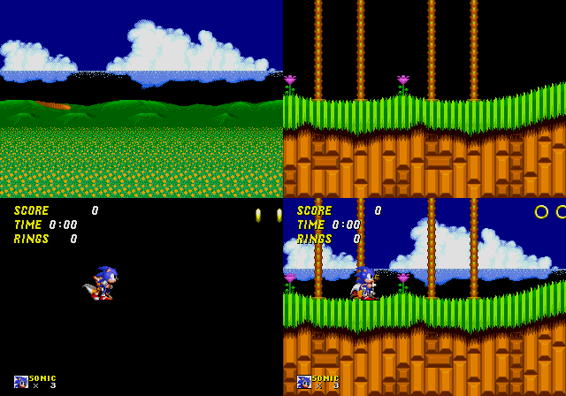
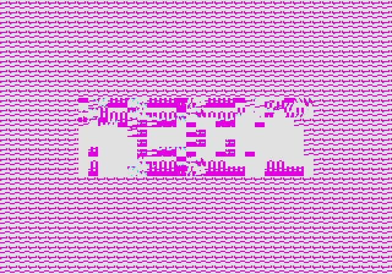

Emulating the Sega Genesis - Part II
====================================

*Also available on [dev.to](https://dev.to/transistorfet/emulating-the-sega-genesis-part-ii-16k7)*

###### *Written December 2021/January 2022 by transistor_fet*


A few months ago, I wrote a 68000 emulator in Rust named
[Moa](https://jabberwocky.ca/projects/moa/).  My original goal was to emulate a simple
[computer](https://jabberwocky.ca/projects/computie/) I had previously built.  After only a few
weeks, I had that software up and running in the emulator, and my attention turned to what other
platforms with 68000s I could try emulating.  My thoughts quickly turned to the Sega Genesis and
without thinking about it too much, I dove right in.  What started as an unserious half-thought of
"wouldn't that be cool" turned into a few months of fighting documentation, game programming hacks,
and my sanity with some side quests along the way, all in the name of finding and squashing bugs in
the 68k emulator I had already written.

This is Part II in the series.  If you haven't already read [Part
I](https://jabberwocky.ca/posts/2022-01-emulating_the_sega_genesis_part1.html), you might want to do
so.  It covers setting up the emulator, getting some game ROMs to run, and implementing the DMA and
memory features of the VDP.  Part II covers adding a graphical frontend to Moa, and then
implementing a first attempt at generating video output.  [Part
III](https://jabberwocky.ca/posts/2022-01-emulating_the_sega_genesis_part3.html) will be about
debugging the various problems in the VDP and CPU implementations to get a working emulator capable
of playing games.  For more detail on the 68000 and the basic design of Moa, check out [Making a
68000 Emulator in Rust](https://jabberwocky.ca/posts/2021-11-making_an_emulator.html).

* [Previously](#previously)
* [Choosing A Graphics Crate](#choosing-a-graphics-crate)
* [Abstracting Out The Frontend](#abstracting-out-the-frontend)
* [Updating Windows](#updating-windows)
* [The VDP Device](#the-vdp-device)
* [Colours And Patterns](#colours-and-patterns)
* [Scrolls And Sprites](#scrolls-and-sprites)
* [Next Time](#next-time)


Previously
----------

In less than a week, I had taken my 68000 emulator, plugged some Sega Genesis ROMs into it, written
some boilerplate devices, and implemented the memory and DMA operations of the Genesis' video
display processor (VDP).  I could watch the log messages produced by the emulator as the ROMs were
being interpreted instruction by instruction, reading the controller data, writing to the VDP, and
generally doing things.  (Doing what?  I didn't quite know yet).

The CPU interface to the VDP was pretty much done, so the next thing to work on was actually
displaying output.  The data, which is already loaded into VRAM, CRAM, and VSRAM, as well as the
internal VDP registers, needs to be turned into pictures.  While the real hardware would generate a
CRT video signal which would directly control a CRT-based television, the emulator will generate a
single frame of video at a time, stored in a buffer, and display that buffer in a local window on
the host computer.  Do this fast enough and I'll have video.


Choosing A Graphics Crate
-------------------------

Before I could implement the display output, I needed something to draw the images onto.  There are
quite a few Rust crates available to create a GUI window and update it with 2D graphics.  Most of
these are of course intended for making games, and also include ways of getting key presses as
input, which I'll also need.  I looked at [Piston](https://www.piston.rs), which I've used before on
other projects, [Macroquad](https://macroquad.rs/), which also supports web assembly as well as
desktop targets, [Pixels](https://github.com/parasyte/pixels), which is intended specifically for 2D
games, and [Minifb](https://github.com/emoon/rust_minifb), which is also specifically for 2D
applications, but is much simpler.  I also tried out
[libretro](https://github.com/koute/libretro-backend), which is specifically made for video game
emulation, but I found it much more restrictive than the others because of it's narrow focus.

Initially I had wanted to run the simulation in another thread so that I could run it the same way I
had been for emulating Computie, but most of these libraries are set up to use a single thread and
single main loop where everything happens in-line with the screen updating and input reading.  For a
typical video game, the gameplay and any frame updating would be done just before submitting the
frame buffer to the library to be drawn to the screen, and then the library would block until the
next frame is needed.

In order to run it inline with the update loop, I added a function to `System` to only run the step
functions for a given amount of simulated time before returning, which would allow the simulation to
proceed far enough for the next frame to be updated before the loop updates the GUI window.  Even
though there is no specific coordination between when the frame is updated vs how much simulated
time has passed, it still works surprisingly well.  That said I'm still concerned with the fact that
the emulator is not cycle-accurate yet, so the simulated time is not accurate either.  Having the
option of running it in another thread would allow me to use other means of coordinating the
simulation with the real clock, and would give me more options when I implement other platforms.
This was a major factor in choosing a library.

Piston is feature rich, and it's modular design allows it to be tailored for any given use, but it's
a bit more than I need for this project.  It includes all sorts of drawing primitives for 2D
graphics, but what I really want is to just draw individual pixels to a buffer, or update the entire
screen at once from a pre-drawn buffer.  The size of the compiled binary using Piston was over 100MB
too, with Pixels coming in a close second in size.

Pixels was also a bit more than I needed.  It's based on `wgpu` which supports all sorts of GPU
features like shading, but I don't need any of that since the Genesis will only generate raw pixel
data, so the extra features just make it more complicated than it needs to be.

Macroquad is much lighter, by comparison, but because it can run in a web browser, it has some
restrictions on how the updating can be done.  It uses an `async` main function because in
WebAssembly, the main loop cannot block like a normal loop without inhibiting other background code.
It would be neat to run Moa in web assembly, but porting it to run in web assembly could be a lot of
work that I don't intend to do any time soon, and since Macroquad wont easily support the threaded
mode, I'll leave it as a possible secondary frontend for a later date.

Libretro has a similar restriction in that you give it a function to be called each time a frame is
needed, and the simulation would have to be run in that time.  However it also supplies its own main
function and update loop, and control is only passed to the specific machine emulator when a game is
loaded (which is also handled by the library) or when the next frame of data is needed.  It might be
fine for a single-purpose video game emulator but it really doesn't fit with my hope for a more
general simulation platform, so this definitely isn't a good choice as my primary frontend.

That left Minifb, which turned out to be the best fit.  It's very simple without a lot of features.
You create a window (just one function call), a frame buffer to fill the window, and a main loop
which just has to call a function to update the frame buffer to the screen.  An optional frame
limiter can be used, which causes the update function to block until the next frame is needed, but
the simulation can be run on a separate thread too.  Input can be read during the main loop, and the
main loop is implemented entirely in the application-side, so it's a bit more flexible without being
complicated for my needs.  The compiled binary comes in at only 5 or 6 MB as well, which nice.


Abstracting Out The Frontend
----------------------------

As usual, given my obsession with flexibility and modularity, I set up the frontend so that it can
be swapped out with another one.  I need both a console-only "frontend" for Computie, and the minifb
frontend for the Sega Genesis, so I made separate crates for each.  Cargo has a "workspaces" feature
to make it easy to organize a single repository into multiple crates, each compiled separately.  The
Cargo.toml file in the root directory of the project needs the following lines:

```toml
[workspace]
members = [".", "frontends/moa-console", "frontends/moa-minifb"]
```

The first directory is the current directory, which has the common Moa code in `src/`, and
dependencies for that crate also go in the same Cargo.toml file in the root of the project.  Each of
the frontends have their own Cargo.toml files with their own dependencies and feature flags.  They
also contain files in `frontends/<name>/src/bin/<machine>.rs` which will be compiled into separate
binaries, one for each machine that can be run using that frontend, which makes it easier to run
different machines.  In this configuration, if using cargo to compile and run a given binary, both
the crate and binary name must be specified or else cargo will use the configured default.

The Genesis machine can be run using:
```
cargo run -p moa-minifb --bin moa-genesis
```

The `moa-genesis` binary looks something like this, with all the details hidden in `init_frontend`
and `start`:

```rust
use moa_minifb;
use moa::machines::genesis::build_genesis;

fn main() {
    let mut frontend = MiniFrontend::init_frontend();
    let mut system = build_genesis(&frontend).unwrap();

    frontend.start(system);
}
```

In order to provide a generic frontend-agnostic interface between the common Moa devices and a
specific frontend, there is a `Host` trait which is implemented by each frontend, and passed to the
machine building function to build the `System` object.  Through that trait, the machine definition
can register a callback for whichever devices need to output video data (which is machine-specific).
Separate callbacks can be registered through the same `Host` trait to get data from the keyboard or
controllers.

```rust
pub trait Host {
    fn add_window(&mut self, _updater: Box<dyn WindowUpdater>) -> Result<(), Error> {
        // Default implementation if it's not defined in the 'impl Host for ...'
        Err(Error::new("This frontend doesn't support windows"))
    }

    fn register_controller(&mut self, _device: ControllerDevice, _input: Box<dyn ControllerUpdater>) -> Result<(), Error> {
        // Default implementation if it's not defined in the 'impl Host for ...'
        Err(Error::new("This frontend doesn't support game controllers"))
    }
}

pub trait WindowUpdater: Send {
    fn get_size(&mut self) -> (u32, u32);
    fn update_frame(&mut self, width: u32, height: u32, bitmap: &mut [u32]);
}

pub trait ControllerUpdater: Send {
    fn update_controller(&mut self, event: ControllerEvent);
}
```

The `Host` trait is implemented by each frontend and passed to the function that builds the machine
configuration, before the simulation is started.  The machine configuration can choose to create a
window only when needed by that machine.  Not shown in the above snippet are the `Host` functions
to create PTYs (used only by Computie), and to register a keyboard updater (used by the TRS-80 and
Macintosh machines).

```rust
pub struct MiniFrontend {
    pub updater: Option<Box<dyn WindowUpdater>>,
}

impl Host for MiniFrontend {
    fn add_window(&self, updater: Box<dyn WindowUpdater>) -> Result<(), Error> {
        if self.updater.is_some() {
            return Err(Error::new("A window updater has already been registered with the frontend"));
        }
        self.updater = Some(updater);
        Ok(())
    }
}

impl MiniFrontend {
    pub fn init_frontend() -> MiniFrontend {
        MiniFrontend {
            updater: None,
        }
    }

    pub fn start(&self, mut system: System) {
        let buffer = vec![0; WIDTH * HEIGHT]
        let options = minifb::WindowOptions::default();
        let mut window = minifb::Window::new("Test", WIDTH, HEIGHT, options).unwrap();

        // Limit to max ~60 fps update rate
        window.limit_update_rate(Some(Duration::from_micros(16600)));

        while window.is_open() && !window.is_key_down(Key::Escape) {
            // Run the simulation for 16.6ms, the same as the frame limiter
            system.run_for(16_600_000).unwrap();

            if let Some(updater) = self.updater {
                updater.update_frame(WIDTH as u32, HEIGHT as u32, &mut buffer);
                window.update_with_buffer(&buffer, WIDTH, HEIGHT).unwrap();
            }
        }
    }
}
```

There's not much to it.  Only one window can be created at the moment, and input is not yet
supported.  The threaded option is also not shown here.  Before long, the code grew more
complicated, and now includes parsing of command line arguments with the `clap` crate.  To see the
latest version, check out the [Genesis machine-specific
binary](https://github.com/transistorfet/moa/blob/c3951999771bbb56f45e1a8c5cd0b61758aed778/frontends/moa-minifb/src/bin/moa-genesis.rs)
and the [MiniFB host impl and main
loop](https://github.com/transistorfet/moa/blob/c3951999771bbb56f45e1a8c5cd0b61758aed778/frontends/moa-minifb/src/lib.rs)


Updating Windows
----------------

I now needed to implement the `WindowUpdater` trait and to do this, I made a `Frame` object which
holds a single frame in a buffer.  When the update function is called, the frame buffer will be
copied to the minifb buffer.  Pixel data can be fed to the `.blit` function using an Iterator,
rather than using yet another intermediate buffer for individual images drawn to the frame.  The
`Arc<Mutex<Frame>>` used in the updater is necessary for the threaded version, so that the frame can
be held both by the simulation thread and by the UI thread at the same time.

```rust
// If a pixel has this value, it wont be copied to the buffer
const MASK_COLOUR: u32 = 0xFFFFFFFF;

pub trait BlitableSurface {
    fn blit<B: Iterator<Item=u32>>(&mut self, pos_x: u32, pos_y: u32, bitmap: B, width: u32, height: u32);
    fn clear(&mut self, value: u32);
}

#[derive(Clone)]
pub struct Frame {
    pub width: u32,
    pub height: u32,
    pub bitmap: Vec<u32>,
}

impl Frame {
    pub fn new(width: u32, height: u32) -> Self {
        Self { width, height, bitmap: vec![0; (width * height) as usize] }
    }
}

impl BlitableSurface for Frame {
    fn blit<B: Iterator<Item=u32>>(&mut self, pos_x: u32, pos_y: u32, mut bitmap: B, width: u32, height: u32) {
        for y in pos_y..(pos_y + height) {
            for x in pos_x..(pos_x + width) {
                match bitmap.next().unwrap() {
                    MASK_COLOUR =>
                        { },
                    value if x < self.width && y < self.height =>
                        { self.bitmap[(x + (y * self.width)) as usize] = value; },
                    _ =>
                        { },
                }
            }
        }
    }

    fn clear(&mut self, value: u32) {
        let value = if value == MASK_COLOUR { 0 } else { value };
        for i in 0..((self.width as usize) * (self.height as usize)) {
            self.bitmap[i] = value;
        }
    }
}

pub struct FrameUpdateWrapper(Arc<Mutex<Frame>>);

impl WindowUpdater for FrameUpdateWrapper {
    fn get_size(&mut self) -> (u32, u32) {
        let frame = self.0.lock().unwrap();
        (frame.width, frame.height)
    }

    fn update_frame(&mut self, width: u32, _height: u32, bitmap: &mut [u32]) {
        let frame = self.0.lock().unwrap();
        for y in 0..frame.height {
            for x in 0..frame.width {
                bitmap[(x + (y * width)) as usize] =
                    frame.bitmap[(x + (y * frame.width)) as usize];
            }
        }
    }
}
```

I know I'm copying the buffer twice when updating the frame, but it's a compromise in the name of
flexibility.  A buffer held only by the frontend is passed into `WindowUpdate::update_frame()`, into
which the frame data is copied, and then that frontend buffer is passed to minifb's
`.update_with_buffer()` function.  The trouble is that minifb uses its `.update_with_buffer()`
function to also limit the frame rate.  The frame limiter is set to 60 updates a second, and the
delay that's necessary to achieve that limit happens before the update function returns.  The delay
is typically between 10 to 12 ms in order to achieve a total 16.6ms delay between frames.

If the shared frame buffer is passed to the minifb update function, the lock on the frame will be
held until the delay expires and the function returns.  If the simulation code is run between
frames, then holding the lock isn't so much a problem because it's only after the update function
returns that the frame will be accessed, but if the simulation is run in a separate thread, then the
lock contention makes the frame rate excruciatingly slow.  Since I wanted the option to run the
simulation in a separate thread, and since the extra buffer copy is negligible on a typical desktop,
I've kept it, but if I ever try to run in on slower hardware, I might see about redesigning this.

There is also the issue of partial frames.  Currently the VDP simulation code draws an entire frame
at once instead of more accurately drawing it line by line spread out over many calls to its step
function.  I suspect that this causes the issue with the Sonic 2 title screen where Tails appears to
be an incorrect colour.  The ROM might be trying to change the colour palette while the image is
being updated in order to pack more colours onto the screen at once.

The advantage of updating all at once, however, is that the frame will always be completely drawn
when the frame buffer lock is obtained.  I had originally written some code have two frames, and to
swap them after each draw cycle is complete, so that there's always a complete frame available when
the screen is updated.  If the simulation is running slow, then the same completed frame will be
sent more than once.  If it's too fast, then some frames wont be sent to the screen at all before
being redrawn.  This turned out to not be necessary because of the all-at-once update, but since I
will likely need to change to line-by-line updating in the future, the `FrameSwapper` code has been
left in place in the actual Moa code.


The VDP Device
--------------

I can now add the frame buffer to the VDP device, including the call to `.add_window()` to register
it with the frontend, and some logic to handle the horizontal and vertical interrupts.

```rust
pub struct Ym7101State {
    pub regs: [22; u8],                 // The internal registers of the VDP

    pub last_clock: Clock,
    pub h_clock: u32,                   // Used to generate the horizontal interrupt
    pub v_clock: u32,                   // Used to generate the vertical interrupt
    pub h_scanlines: u32,

    ...                                 // Additional fields used by memory/DMA code
}

pub struct Ym7101 {
    pub frame: Arc<Mutex<Frame>>,       // The output video frame, shared with the frontend
    pub state: Ym7101State,
}

impl Ym7101 {
    pub fn new<H: Host>(host: &H) -> Ym7101 {
        let frame = Frame::new(320, 224);

        host.add_window(Box::new(frame.clone()));

        Ym7101 {
            frame,
            state: Ym7101State::new(),
        }
    }
}

impl Steppable for Ym7101 {
    fn step(&mut self, system: &System) -> Result<ClockElapsed, Error> {
        // Calculate the actual time since the last step occured
        let diff = (system.clock - self.state.last_clock) as u32;
        self.state.last_clock = system.clock;

        // Reset the interrupts
        if self.state.reset_int {
            system.get_interrupt_controller().set(false, 4, 28)?;
            system.get_interrupt_controller().set(false, 6, 30)?;
        }

        self.state.h_clock += diff;
        if self.state.h_clock > 63_500 {
            self.state.h_clock -= 63_500;

            // Trigger the horizontal interrupt
            //   The H Interrupt register has the number of lines that should be
            //   drawn before the interrupt occurs
            self.state.h_scanlines = self.state.h_scanlines.wrapping_add(1);
            if self.state.hsync_int_enabled() && self.state.h_scanlines >= self.state.regs[REG_H_INTERRUPT] {
                self.state.h_scanlines = 0;
                system.get_interrupt_controller().set(true, 4, 28)?;
                self.state.reset_int = true;
            }
        }

        self.state.v_clock += diff;
        if self.state.v_clock > 16_630_000 {
            self.state.v_clock -= 16_630_000;

            // Trigger the vertical interrupt
            if self.state.vsync_int_enabled() {
                system.get_interrupt_controller().set(true, 6, 30)?;
                self.state.reset_int = true;
            }

            // Lock the frame and update it
            let mut frame = self.frame.lock().unwrap();
            self.state.draw_frame(&mut frame);
        }

        // Run the DMA transfer if configured
        self.state.step_dma(system)?;

        Ok((1_000_000_000 / 13_423_294) * 4)
    }
}
```

The `.step()` function will increment the `v_clock` until it has counted the number of nanoseconds
between refreshes on an NTSC television, which is 16.63 milliseconds.  At that point, it will
trigger the vertical interrupt and update the frame all at once.  There is also a horizontal
interrupt which can be configured to trigger only after a certain number of lines have been drawn.

I've shown here the original way I implemented interrupts, which was only intended to be temporary.
It definitely caused problems and was fixed not long after, but I'll go into more detail in Part III
where I talk about the process of debugging.


Colours And Patterns
--------------------

Before anything can be drawn, there needs to be some colours, and all the colours drawn by the VDP
are stored in the CRAM.  The CRAM can hold up to 4 different 16-colour palettes, with each palette
colour specified as a 9-bit RGB colour, which is actually organized as a 12-bit colour in a 16-bit
memory location. (Yikes)  The extra bits are not actually implemented in the hardware VDP to save
space on the chip, but for the purposes of emulating, I'll just store each colour in a 16-bit word.
This means CRAM will be 128 bytes in size.  The colours are actually stored in BGR order in the
word, so a middle red colour would be 0x008 and a middle blue colour would be 0x800.  To make the
brightest white, the colour value would be 0xEEE (since the lower bit of each RGB component is
always 0).

Technically this allows up to 512 different colours to be displayed, but only 64 of them can be on
the screen at once because of the limited palette size.  A further limit is that the `0` colour of
each palette is a special mask colour which won't be drawn, so that any pixel below it will show
through.  This is especially useful for sprites, so that they can be drawn on top of the other
graphics without squared edges.  There are also special highlight and shadow modes which shift the
colour output either high or low so that the 9-bit colour value is spread across only half of the
colour range, which increases the total possible colours that can be displayed.  That feature has
some complex conditions to determine when to use the shadow or highlight mode, so I just left it
unimplemented for the time being.

All graphics generated by the VDP are made up of 8x8 pixel images called cells.  A cell is generated
using a pattern which contains the pixel data, in combination with a palette number.  Each pixel in
the pattern is a 4-bit number, which selects one of 16 colours from the current colour palette.
That means each pattern is 32 bytes long, and each byte in the pattern will contain two pixels of
data with the upper nibble being the first pixel, and the lower nibble being the second.  The first
pixel in the first byte corresponds to the upper left hand corner of the pattern, and the pixels are
organized from left to right, top to bottom.

All the patterns must be in VRAM to be drawn, and they start from address 0 in VRAM, with the first
32 bytes being pattern 0, the next 32 bytes being pattern 1, and so on.  When a pattern is
referenced, an 11-bit number is used, which is then multiplied by 32 (or shifted to the left by 5
bits) to get the address in VRAM where the patterns starts.  So a pattern can be anywhere in the
64KB of VRAM, so long as it's aligned to a 32 byte boundary.  The pattern reference also includes
the palette number to use for drawing the pattern, and whether the pattern should be reversed in the
horizontal and/or vertical direction.  This allows the same pattern to be used more often, saving
space in VRAM.

Since generating the pattern data takes some translation, I opted to use an iterator to return the
data.  Each iteration will return one of 64 pixels as a 32-bit number which can then be written
directly to the frame buffer.

```rust
pub struct PatternIterator<'a> {
    state: &'a Ym7101State,     // A stored reference which is needed to access the colour values
    palette: u8,                // The palette number (0-3)
    base: usize,                // The base address in VRAM where the pattern starts
    h_rev: bool,                // Whether to reverse it horizontally
    v_rev: bool,                // Whether to reverse it vertically
    line: i8,                   // Current line (needed by reversing code)
    col: i8,                    // Current column (needed by reversing code)
    second: bool,               // Whether this is the second pixel (lower nibble) in the byte
}

impl<'a> PatternIterator<'a> {
    pub fn new(state: &'a Ym7101State, start: u32, palette: u8, h_rev: bool, v_rev: bool) -> Self {
        Self {
            state,
            palette,
            base: start as usize,
            h_rev,
            v_rev,
            line: 0,
            col: 0,
            second: false,
        }
    }
}

impl<'a> Iterator for PatternIterator<'a> {
    type Item = u32;

    fn next(&mut self) -> Option<Self::Item> {
        let line = (if !self.v_rev { self.line } else { 7 - self.line }) as usize;
        let column = (if !self.h_rev { self.col } else { 3 - self.col }) as usize;
        let offset = self.base + line * 4 + column;

        let value = if (!self.h_rev && !self.second) || (self.h_rev && self.second) {
            self.state.get_palette_colour(self.palette, self.state.vram[offset] >> 4)
        } else {
            self.state.get_palette_colour(self.palette, self.state.vram[offset] & 0x0f)
        };

        if !self.second {
            self.second = true;
        } else {
            self.second = false;
            self.col += 1;
            if self.col >= 4 {
                self.col = 0;
                self.line += 1;
            }
        }

        Some(value)
    }
}
```

It's a bit messy, and I'm sure I could optimize it, but it works for now.  At this point I'm still
focused on getting something working more than cleaning up and optimizing the code.  (Note: I ended
up throwing this code away, which goes to show it's not always worth getting hung up on the quality
of code when in early development and things are changing rapidly.  I'll talk more about the change
in Part III).


Scrolls And Sprites
-------------------

Now that there's a way to draw cells to the screen, how is the VDP told which ones to draw and
where?  There are two ways.  They can either be specified in one of the two scroll tables, or they
can be specified in a sprite.

There are two moveable planes called Scroll A and Scroll B, the tables for which are stored in VRAM
and the starting address of each table is stored in their own VDP registers.  Each table is an array
of 16-bit words where each word is called a pattern name and contains the pattern number, the colour
palette to render it with, two bits to reverse the pattern in the horizontal and/or vertical
direction, and a priority bit used to determine the draw order of the different planes.  The exact
format in memory is better shown at
[megadrive.org](https://wiki.megadrive.org/index.php?title=VDP_Scrolls) and
[segaretro.org](https://segaretro.org/Sega_Mega_Drive/Planes)

Both scrolls must be the same size, but the size can be any combination of 32, 64, or 128 cells in
either direction.  This means they are usually bigger than the size of the screen itself, which for
the NTSC version is usually 40 x 28 cells (320 x 224 pixels).  Which portion of the scroll plane to
draw on the screen can be controlled using the scrolling features of the VDP, which at its simplest
is just two numbers per plane to specify the vertical and horizontal offset of the scroll relative
to the upper left corner of the screen, but at it's most complex can have a different offset for
each line of pixels which controls the horizontal position of each line.  I left the scrolling
functionality unimplemented until the scroll planes were working, so I'll go into more detail about
it later.  For the logo and title screens, there usually isn't a scroll offset, so displaying the
upper left corner of the scroll at the upper left corner of the screen should still display
something.

There is also a special fixed plane called the window, but not many games seem to use it and my
early attempts at implementing it caused weird graphics, so I left it for later.

The other way to draw to the screen is using sprites.  Like the scrolls, a table of sprite data is
stored in VRAM and a special register contains the address of the start of that table.  Unlike the
scrolls, each entry in the sprite table is four 16-bit words instead of just one, with each entry
corresponding to an independent sprite.  For each sprite, there is a vertical and horizontal
position (relative to the upper left corner of the screen minus 128 pixels in each direction), the
size of the sprite in cells (a single sprite can be comprised of up to 4 x 4 cells), the pattern
name to use for the first cell (in the same format as the scrolls), and a link number.  The
organization of a sprite entry is more clearly displayed
[here](https://wiki.megadrive.org/index.php?title=VDP_Sprites)

The link number is used to determine the sprite priority.  Sprite 0, which is the first entry in the
table, is always the highest priority sprite.  Its link number is the index in the sprite table for
the next highest priority sprite, which could be anywhere in the sprite table.  That sprite's link
number would then point to the next highest priority sprite and so on until a sprite has a link
number of 0.  When multiple sprites are on top of each other, the highest priority sprite will
appear on top.

<p align="center">

</p>

This shows the breakdown of the different planes that are combined to form the final output.  From
the top left to the bottom right is Scroll B (the background), Scroll A (the foreground), the
Sprites (the moveable graphics), and then the final image is the three planes combined.

The following code is my first attempt at implementing this.  (Please note: this code contains many
issues but it wasn't until after much debugging that I figured out what they all were.  I'd like to
describe the process of debugging this code in Part III, so I'm showing the code that I started with
here.  Bonus points to anyone who can figure out the bugs without reading onward).

```rust
pub fn draw_frame(&mut self, frame: &mut Frame) {
    self.draw_background(frame);
    self.draw_cell_table(frame, ((self.regs[REG_SCROLL_B_ADDR] as u16) << 13) as u32);
    self.draw_cell_table(frame, ((self.regs[REG_SCROLL_A_ADDR] as u16) << 10) as u32);
    self.draw_sprites(frame);
}

fn draw_background(&mut self, frame: &mut Frame) {
    let bg_colour = self.get_palette_colour((self.regs[REG_BACKGROUND] & 0x30) >> 4, self.regs[REG_BACKGROUND] & 0x0f);
    frame.clear(bg_colour);
}

fn draw_cell_table(&mut self, frame: &mut Frame, cell_table: u32) {
    let (scroll_h, scroll_v) = self.get_scroll_size();
    let (cells_h, cells_v) = self.get_screen_size();

    for cell_y in 0..cells_v {
        for cell_x in 0..cells_h {
            let pattern_name = read_beu16(&self.vram[(cell_table + ((cell_x + (cell_y * scroll_h)) << 1) as u32) as usize..]);
            let iter = self.get_pattern_iter(pattern_name);
            frame.blit((cell_x << 3) as u32, (cell_y << 3) as u32, iter, 8, 8);
        }
    }
}

fn build_link_list(&mut self, sprite_table: usize, links: &mut [usize]) -> usize {
    links[0] = 0;
    let mut i = 0;
    loop {
        let link = self.vram[sprite_table + (links[i] * 8) + 3];
        if link == 0 || link > 80 {
            break;
        }
        i += 1;
        links[i] = link as usize;
    }
    i
}

fn draw_sprites(&mut self, frame: &mut Frame) {
    let sprite_table = (self.regs[REG_SPRITES_ADDR] as usize) << 9;
    let (cells_h, cells_v) = self.get_screen_size();
    let (pos_limit_h, pos_limit_v) = (if cells_h == 32 { 383 } else { 447 }, if cells_v == 28 { 351 } else { 367 });

    let mut links = [0; 80];
    let lowest = self.build_link_list(sprite_table, &mut links);

    for i in (0..lowest + 1).rev() {
        let sprite_data = &self.vram[(sprite_table + (links[i] * 8))..];

        let v_pos = read_beu16(&sprite_data[0..]);
        let size = sprite_data[2];
        let pattern_name = read_beu16(&sprite_data[4..]);
        let h_pos = read_beu16(&sprite_data[6..]);

        let (size_h, size_v) = (((size >> 2) & 0x03) as u16 + 1, (size & 0x03) as u16 + 1);
        let h_rev = (pattern_name & 0x0800) != 0;
        let v_rev = (pattern_name & 0x1000) != 0;

        for ih in 0..size_h {
            for iv in 0..size_v {
                let (h, v) = (if !h_rev { ih } else { size_h - ih }, if !v_rev { iv } else { size_v - iv });
                let (x, y) = (h_pos + h * 8, v_pos + v * 8);
                if x > 128 && x < pos_limit_h && y > 128 && y < pos_limit_v {
                    let iter = self.get_pattern_iter(pattern_name + (h * size_v) + v);

                    frame.blit(x as u32 - 128, y as u32 - 128, iter, 8, 8);
                }
            }
        }
    }
}

fn get_pattern_iter<'a>(&'a self, pattern_name: u16) -> PatternIterator<'a> {
    let pattern_addr = (pattern_name & 0x07FF) << 5;
    let pattern_palette = ((pattern_name & 0x6000) >> 13) as u8;
    let h_rev = (pattern_name & 0x0800) != 0;
    let v_rev = (pattern_name & 0x1000) != 0;
    PatternIterator::new(&self, pattern_addr as u32, pattern_palette, h_rev, v_rev)
}

fn get_scroll_size(&self) -> (u16, u16) {
    let h = scroll_size(self.regs[REG_SCROLL_SIZE] & 0x03);
    let v = scroll_size((self.regs[REG_SCROLL_SIZE] >> 4) & 0x03);
    (h, v)
}

fn get_screen_size(&self) -> (u16, u16) {
    let h_cells = if (self.regs[REG_MODE_SET_4] & MODE4_BF_H_CELL_MODE) == 0 { 32 } else { 40 };
    let v_cells = if (self.regs[REG_MODE_SET_2] & MODE2_BF_V_CELL_MODE) == 0 { 28 } else { 30 };
    (h_cells, v_cells)
}
```

And after running this with the Sonic 1 ROM, I'm greeted by...

<p align="center">

</p>

Well it kinda looks like the SEGA logo but why are the colours so wrong...


Next Time
---------

After about two weeks or so of working on the Sega Genesis support for Moa, reading up on the
internal workings of the console, implementing a simple swappable frontend, and implementing my
first best guess of how it should work, I could display a very mangled image with bright magenta
colours instead of blues.  To be honest, I was a bit dejected.  I was hoping to have something that
at least looked coherent before I added my work in progress to git.  Fiddling with it wasn't
improving matters at all, so it wasn't going to be a quick fix.  I was going to have roll up my
sleeves and grind it out.

This is where the real journey began, tirelessly debugging until I hit a wall, taking some detours,
working on other projects for a while, eventually returning to it, isolating the problems with the
help of some test ROMs and another Genesis emulator as a reference, and finally getting it working.
Stay tuned for the (not so) thrilling conclusion in [Part
III](https://jabberwocky.ca/posts/2022-01-emulating_the_sega_genesis_part3.html) of Emulating The
Sega Genesis.

